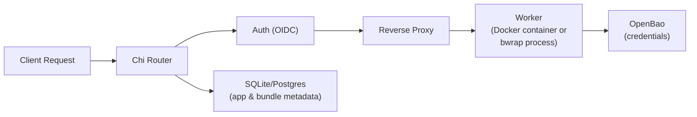

# blockyard

[](https://github.com/cynkra/blockyard/actions/workflows/ci.yml)
[](https://codecov.io/gh/cynkra/blockyard)

A containerized hosting platform for [Shiny](https://shiny.posit.co/) applications, built in Go. Blockyard manages the deployment, scaling, and reverse-proxying of isolated R Shiny app containers using Docker.

## Overview

Blockyard acts as a reverse proxy and application server that spawns an isolated worker per user session. Workers run in one of two backends:

- **Docker/Podman** (default) — each worker is a container with a private bridge network and cgroup resource limits.
- **Process (bubblewrap)** — each worker is a `bwrap`-sandboxed child process with PID/mount/user namespaces and capability dropping, no container runtime required.

The server is generic over a `Backend` interface, so the two runtimes are interchangeable. See [Backend Security](docs/content/docs/guides/backend-security.md) for the trade-offs.

**Key design choices:**

- One content type: Shiny / [blockr](https://github.com/blockr-org/blockr) apps (not Plumber APIs, static sites, or scheduled tasks)
- Linux host required (bubblewrap is Linux-only; Docker/Podman usable on macOS via Docker Desktop)
- Per-session worker isolation by default

## Architecture



## Tech Stack

- **Go** 1.25 with standard library `net/http`
- **Chi** — HTTP router with middleware support
- **Docker SDK** — Docker API client (`github.com/docker/docker`), used by the Docker backend
- **bubblewrap** — `bwrap` sandbox helper, used by the process backend
- **modernc.org/sqlite** — pure-Go SQLite driver
- **Redis** — optional shared state for rolling updates and multi-server coordination (`redis/go-redis`)
- **OIDC** — OpenID Connect authentication (`coreos/go-oidc/v3`)
- **OpenBao** — credential management (Vault-compatible)
- **Prometheus** — metrics (`prometheus/client_golang`)
- **OpenTelemetry** — distributed tracing
- **log/slog** — structured JSON logging

## Getting Started

### Prerequisites

- Go 1.25+
- A Linux host (Windows and macOS supported for the Docker backend via Docker Desktop)
- Either:
  - **Docker backend:** Docker or Podman with a Docker-compatible socket, or
  - **Process backend:** `bubblewrap` and `R` on the host. See [Process Backend (Native)](docs/content/docs/guides/process-backend.md).
- SQLite 3 (bundled in-binary via `modernc.org/sqlite`)

### Configuration

Copy and edit the example configuration:

```bash
cp blockyard.toml blockyard.toml.local
```

All settings can be overridden with environment variables using the
`BLOCKYARD_<SECTION>_<FIELD>` pattern (uppercased). For example,
`server.bind` becomes `BLOCKYARD_SERVER_BIND`.

### Build & Run

```bash
# Build
go build -o blockyard ./cmd/blockyard

# Run tests
go test ./...
```

### Dev Container

A devcontainer configuration is included for VS Code / GitHub Codespaces:

```bash
# Open in VS Code with the Dev Containers extension
code .
# Then: Reopen in Container
```

**Native mode** (`go run ./cmd/blockyard` directly) requires that Docker
container IPs on bridge networks are routable from the host. This is the
case on Linux and with some macOS Docker runtimes, but not all. If
container IPs are not routable from your host, run the server inside a
container (e.g. the devcontainer) instead.

## Project Layout

- `cmd/blockyard/` — Server entry point.
- `cmd/by/` — CLI client (`by`) for deploying apps, managing access, and server administration.
- `cmd/by-builder/` — Helper binary mounted into build containers to run dependency restores.
- `cmd/seccomp-compile/` — Build-time tool that compiles JSON seccomp profiles to the BPF blob shipped inside the `blockyard-process` image.
- `docker/` — Dockerfiles for the three image variants (`server.Dockerfile`, `server-process.Dockerfile`, `server-everything.Dockerfile`).
- `internal/` — All application code, organized by domain:
  - `api/` — HTTP handlers for the management API (apps, bundles, users, tags, admin update, etc.)
  - `auth/`, `authz/` — OIDC authentication, session management, RBAC, and per-app ACLs.
  - `proxy/` — Reverse proxy, WebSocket forwarding, cold-start, session routing, autoscaling.
  - `backend/` — Worker runtime abstraction:
    - `docker/` — Docker/Podman backend.
    - `process/` — bubblewrap process backend.
    - `mock/` — in-memory backend for tests.
  - `bundle/` — Bundle archive storage, unpacking, and R dependency restoration.
  - `db/` — SQLite/PostgreSQL database layer, migrations, and CRUD queries.
  - `drain/` — Graceful drain mode used by the rolling-update orchestrator.
  - `integration/` — OpenBao (Vault) client, bootstrapping, and credential enrollment.
  - `orchestrator/` — Rolling-update state machine with Docker (container clone) and process (fork+exec) variants.
  - `preflight/` — Shared startup-check plumbing; backend-specific checks live under each backend.
  - `redisstate/` — Redis-backed implementations of session/worker/resource stores.
  - `seccomp/` — Embedded seccomp profiles (outer-container and bwrap-inner) and the merge tool.
  - `config/`, `server/` — TOML/env configuration and shared server state.
  - `ops/` — Health polling, log capture, orphan cleanup.
  - `audit/`, `telemetry/` — Audit logging, Prometheus metrics, OpenTelemetry tracing.
- `migrations/` — SQL migration files.

## Documentation

Operator and user documentation lives under [`docs/content/docs/`](docs/content/docs/) and is rendered with Hugo. Highlights:

- [Installation](docs/content/docs/getting-started/installation.md), [Quick Start](docs/content/docs/getting-started/quickstart.md)
- [Deploying an app](docs/content/docs/guides/deploying.md)
- [Authorization](docs/content/docs/guides/authorization.md), [Credential management](docs/content/docs/guides/credentials.md)
- [Backend Security](docs/content/docs/guides/backend-security.md) — Docker vs. process backend trade-offs
- [Process Backend (Native)](docs/content/docs/guides/process-backend.md) / [(Containerized)](docs/content/docs/guides/process-backend-container.md)
- [Observability](docs/content/docs/guides/observability.md)
- Reference: [configuration](docs/content/docs/reference/config.md), [CLI](docs/content/docs/reference/cli.md), [REST API](docs/content/docs/reference/api.md)

See [`blockyard.toml`](blockyard.toml) for a commented example
configuration and [Configuration File](docs/content/docs/reference/config.md)
for the full field-by-field reference.

## Status

Blockyard is in early development. See [`docs/design/roadmap.md`](docs/design/roadmap.md) for the full plan.

## License

This project is licensed under the [GNU General Public License v3.0](LICENSE).
