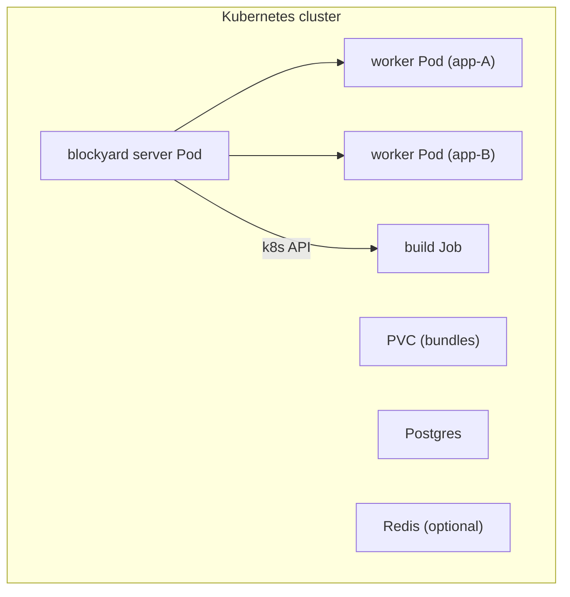

# Backend Strategies

This document compares four backend strategies for running worker processes:
the current Docker/Podman backend, a lightweight process backend using
bubblewrap, a daemonless OCI runtime backend, and a Kubernetes backend. It
also evaluates the Posit Connect sandboxing model as prior art and explains
why it is insufficient for blockyard's threat model.

For the Backend interface definition and current Docker backend implementation,
see [architecture.md](architecture.md). For threat model and credential trust
model, see the same document.

## Threat Model Recap

blockyard apps execute **arbitrary user-supplied R code**. Apps can be
`access_type: public`, meaning completely unauthenticated users trigger code
execution. The isolation mechanism must defend against adversarial code, not
just accidental interference between well-meaning content items. Any credential
or token placed in the process space must be treated as exfiltrable.

The required isolation properties:

1. **Worker-to-worker isolation** — workers cannot see, signal, or communicate
   with each other.
2. **Worker-to-host isolation** — workers cannot access the server's management
   API, configuration, database, or Docker socket.
3. **Network scoping** — workers can reach the internet, Vault (OpenBao), and
   the IdP. Nothing else on the local network. Cloud metadata endpoints
   (`169.254.169.254`) are blocked.
4. **Resource limits** — workers cannot fork-bomb, OOM, or CPU-starve the host.
5. **Filesystem isolation** — workers see only their own app bundle and library
   (read-only), plus a writable tmpfs. No access to other apps' code, the
   server's data directory, or the host filesystem.
6. **Privilege containment** — workers run unprivileged with no Linux
   capabilities. No privilege escalation path.

## Why Not the Posit Connect Model

Posit Connect's local execution mode uses Linux namespaces to sandbox content
processes. It is worth understanding what Connect does — and does not do —
because it is the industry-standard R deployment platform and the natural
reference point for any alternative.

### What Connect does

- **Mount namespace** (`CLONE_NEWNS`): Each content process gets a remapped
  filesystem view via bind mounts. Connect hides its own configuration,
  database (`SQLite.Dir`), and data directory (`Server.DataDir`) from content.
  Each process sees only its own bundle at `/opt/rstudio-connect/mnt/app/`.
- **User namespace** (`CLONE_NEWUSER`): Optional, partial. Provides UID
  remapping when available. Disabled on some distros (RHEL 7 with
  `user.max_user_namespaces = 0`). When unavailable, the sandbox simply omits
  this layer.
- **Per-process temp directories**: Each content process gets its own `/tmp`
  via tmpfs mounted over the shared `/tmp`.
- **Home directory masking**: The real `/home` is hidden. The RunAs user's home
  directory is bind-mounted in its place. Controlled by
  `Applications.HomeMounting`.
- **RunAs user**: Content runs as an unprivileged user. By default all content
  shares a single `rstudio-connect` account. Per-content RunAs overrides and
  RunAsCurrentUser mode are available but require additional configuration.

### What Connect does not do

1. **No PID namespace.** Content processes can enumerate all host processes
   via `/proc`. If multiple content items share the same RunAs UID (the
   default), they can `kill(2)` each other.

2. **No network namespace.** Content processes share the host's full network
   stack. A malicious app can probe the local network, reach other content
   processes, access the Connect management API, reach cloud metadata
   endpoints, and exfiltrate data to arbitrary destinations. There is no
   per-process firewall.

3. **No seccomp or AppArmor/SELinux profiles.** No syscall filtering is
   applied to content processes.

4. **No cgroup resource limits.** No per-process CPU, memory, or I/O limits.

5. **Shared UID by default.** All content runs as the same `rstudio-connect`
   user unless the operator explicitly configures per-content RunAs overrides
   or RunAsCurrentUser mode. Shared UIDs mean shared filesystem permissions
   and the ability to signal other processes.

6. **Root process requirement.** The Connect server runs as root to call
   `unshare(2)` and create bind mounts. When running Connect inside Docker,
   the container requires `--cap-add=CAP_SYS_ADMIN` or `--privileged`.

### Why this is insufficient for blockyard

Connect's sandbox assumes **authenticated publishers** deploying their own
code, consumed by **authenticated viewers**. There is an implicit trust
chain — publishers are known humans accountable for what they deploy.
Connect's sandboxing defends against accidental interference between content
items, not against adversarial code.

blockyard's threat model is fundamentally different: apps run arbitrary R code,
apps can be public, and unauthenticated users can trigger code execution. The
absence of network isolation, PID isolation, syscall filtering, and resource
limits makes Connect's approach inadequate for this use case. A malicious app
running under Connect's sandbox could:

- Scan the local network and reach internal services.
- Access cloud metadata and steal instance credentials.
- Reach other content processes and interfere with them.
- Fork-bomb or OOM-kill the host with no resource limits.
- Enumerate host processes and extract information from `/proc`.

## Current Approach: Docker Backend

The production backend uses the Docker API (`github.com/docker/docker/client`)
to run each worker as an isolated container. Podman is supported transparently
via its Docker-compatible socket.

### Isolation properties

| Property | Mechanism |
|---|---|
| Filesystem | Overlay rootfs + read-only bind mounts for app and library. `--read-only` with tmpfs at `/tmp`. No host filesystem access. |
| PID | PID namespace per container. Processes cannot see or signal anything outside. |
| Network | Per-container bridge network. Server joins each network to proxy traffic. No inter-container connectivity. Metadata endpoint blocked via iptables. |
| Syscalls | Default seccomp profile (~44 dangerous syscalls blocked). |
| Capabilities | `--cap-drop=ALL`, `--security-opt=no-new-privileges`. |
| Resources | cgroups enforce `memory_limit` and `cpu_limit` per container. PID limits prevent fork bombs. |
| Privileges | Content runs as unprivileged user inside the container. No Docker socket mounted. |

### Advantages

- **Defense in depth.** All six isolation properties from the threat model are
  satisfied by default, with no additional host configuration.
- **Well-understood security model.** Container isolation is the
  industry-standard approach for running untrusted code. The attack surface
  (container escape) is well-studied and actively hardened.
- **Rootfs isolation.** Each container has its own filesystem image. Even if a
  process escapes other sandboxing layers, it lands in a minimal container
  rootfs, not the host filesystem.
- **Operational familiarity.** `docker ps`, `docker logs`, `docker inspect`
  are universally understood. Debugging is straightforward.
- **Image management.** R runtime, system libraries, and base packages are
  baked into a Docker image. Version pinning, reproducibility, and rollback
  are handled by image tags.

### Disadvantages

- **Startup latency.** Container creation, network creation, and network
  attachment add ~500ms–1s to cold-start time (on top of R startup time).
  This is the dominant cost for single-session-per-worker deployments where
  every new user pays the cold-start penalty.
- **Docker socket privilege.** The server needs access to the Docker socket
  (`/var/run/docker.sock`), which grants root-equivalent access to the host.
  In the Docker Compose deployment, the server container is given the socket
  via a bind mount. This is the standard Docker-out-of-Docker (DooD) pattern
  but it means a compromised server process can escape its own container
  trivially.
- **Daemon dependency.** Requires a running Docker (or Podman) daemon. This
  is an operational dependency that must be monitored, upgraded, and
  configured.
- **Network overhead.** Per-container bridge networks add complexity. The
  server must multi-home across all active networks to proxy traffic.
  Network creation and cleanup are additional API calls on every worker
  lifecycle event.
- **Resource overhead.** Each container carries the overhead of its own
  network namespace, mount namespace, and cgroup hierarchy. For deployments
  with many short-lived single-session workers, this overhead adds up.
- **Not portable.** Requires Linux with a container runtime. Development on
  macOS requires Docker Desktop or a Linux VM.

### Note: Daemonless OCI as a middle ground

A third option exists: calling a lightweight OCI runtime (`crun` or `runc`)
directly, without the Docker daemon. This is what Podman does under the
hood — blockyard would generate an OCI runtime spec (JSON) and call
`crun create` / `crun start` via `os/exec`. This gives full container
isolation (~50ms startup, rootfs via pre-built tarballs, all namespaces)
without the daemon or socket privilege.

In practice, the benefit over Docker is narrow. The main gain is eliminating
the Docker socket (root-equivalent privilege). But you lose `docker ps/logs/
inspect`, the Docker Go client, image pull/caching, and the monitoring
ecosystem — and must reimplement log capture, state tracking, and rootfs
management. The startup improvement (~50ms vs ~500ms) is real but modest
relative to R's own 1–3s startup. For blockyard's likely deployment
scenarios, the operational cost outweighs the security gain.

If the Docker socket privilege ever becomes a dealbreaker (e.g., a hardened
host policy that prohibits it), the OCI backend is the fallback that
preserves container-equivalent isolation. Until then, Docker or the process
backend below are the practical choices.

## Alternative: Process Backend

A lightweight backend that spawns R processes directly, using bubblewrap
(`bwrap`) for namespace and filesystem isolation — without a container
runtime, daemon, or socket. This is a single-host backend that prioritizes
startup speed (~2ms overhead vs ~500ms–1s for Docker) and operational
simplicity over the full defense-in-depth of the Docker backend.

### Deployment modes

The process backend runs on any Linux system with bubblewrap installed.
How blockyard itself is deployed is an orthogonal choice:

**Containerized (recommended for most users):** blockyard runs inside a
container image that ships R, bwrap, and system libraries. The outer
container provides rootfs containment — a bwrap sandbox escape lands in the
container's minimal filesystem, not the host. This also makes the process
backend portable to macOS and Windows via Docker Desktop. The outer
container requires a custom seccomp profile that allows `CLONE_NEWUSER`
(see [Containerized deployment](#containerized-deployment) below).

**Native (dedicated VM/host):** blockyard runs directly on a Linux host.
The operator provisions R, bwrap, and system libraries. No container
overhead. A bwrap sandbox escape lands on the host filesystem — acceptable
when the host is dedicated to blockyard.

The Go code is identical in both modes — it exec's bwrap the same way.
The difference is purely operational: what's pre-installed and what the
filesystem looks like outside the sandbox.

### Isolation mechanism

bubblewrap (`bwrap`) is a single static binary (~100KB) designed for
sandboxing untrusted code. Used by Flatpak for desktop app sandboxing and
by OpenAI Codex for AI agent code execution. It combines namespaces, bind
mounts, seccomp, and capability dropping into one CLI invocation:

```
bwrap \
  --unshare-pid --unshare-user --unshare-uts \
  --ro-bind / / \
  --ro-bind /data/bundles/app1/v1 /app \
  --ro-bind /data/.pkg-store/worker-abc /blockyard-lib-store \
  --tmpfs /tmp \
  --proc /proc \
  --dev /dev \
  --chdir /tmp \
  --die-with-parent \
  --new-session \
  --cap-drop ALL \
  -- R -e "shiny::runApp('/app', port=as.integer(Sys.getenv('SHINY_PORT')))"
```

The `--ro-bind / /` strategy mounts the entire host root read-only
and then shadows specific paths with writable scratch and app
content — see `phase-3-7.md` for the rationale. The R library mounts
at `/blockyard-lib-store` (store-assembled, phase 2-6) or
`/blockyard-lib` (legacy per-bundle), matching the Docker backend's
convention so the same `R_LIBS` env var resolves on either backend.

The `--unshare-user` flag is critical: it creates a user namespace first,
which allows the remaining namespaces (PID, mount) to be created without
`CAP_SYS_ADMIN`. This is what makes bwrap work inside unprivileged
containers.

### Isolation properties

| Property | Mechanism | Strength |
|---|---|---|
| Filesystem | Bind mounts via bwrap, read-only app and library mounts, writable tmpfs at `/tmp`. | Full |
| PID | `CLONE_NEWPID` via bwrap. Workers cannot see or signal other processes. | Full |
| Syscalls | seccomp-bpf profile applied via bwrap. Same filter as Docker's default. | Full |
| Capabilities | `PR_SET_NO_NEW_PRIVS` + empty capability bounding set. | Full |
| Rootfs | **Containerized:** escape lands in the outer container's filesystem (equivalent to Docker). **Native:** escape lands on the host filesystem (weaker). | Mode-dependent |
| Network | **Not provided.** Workers share the host (or container) network stack. | None |
| Resources | **Not provided.** No per-worker CPU, memory, or PID limits. The outer container's cgroup limits act as a shared ceiling (containerized mode only). | Shared ceiling only |

### What's intentionally not included

**Network isolation** and **per-worker resource limits** are omitted from
the process backend. This is a deliberate scope decision:

- **Network isolation** requires either network namespaces (complex — veth
  pairs, bridges, NAT) or per-UID iptables rules (requires `CAP_NET_ADMIN`
  and a preallocated UID pool). Both add significant operational complexity
  for a backend whose purpose is simplicity.

- **Per-worker resource limits** require cgroup delegation, which is
  difficult to obtain inside a container and adds a systemd dependency on
  native hosts. Posit Connect — the industry-standard R deployment
  platform — does not implement per-process resource limits in its local
  deployment mode either, relying instead on process count management.

For deployments that need network isolation or per-worker resource limits,
use the Docker backend. The process backend is appropriate for internal
deployments, development, and scenarios where startup latency is the
primary concern.

### Containerized deployment

When blockyard runs inside a container, the outer container needs a custom
seccomp profile that allows user namespace creation (`CLONE_NEWUSER`).
Docker's default seccomp profile blocks all `CLONE_NEW*` flags without
`CAP_SYS_ADMIN`.

The custom profile is a copy of Docker's default with one addition:
allowing `clone`/`unshare` with the `CLONE_NEWUSER` argument. This is a
minimal, surgical change — no capabilities are added, no other seccomp
restrictions are relaxed.

```
docker run \
  --security-opt seccomp=blockyard-seccomp.json \
  --read-only \
  ghcr.io/cynkra/blockyard:latest
```

No `--privileged`, no `--cap-add SYS_ADMIN`, no Docker socket mount.

**Prior art:** OpenAI Codex uses the same approach — bubblewrap inside a
container with `--unshare-user` for nested namespace creation. They
validated this pattern at scale for sandboxing AI agent code execution.
See [containers/bubblewrap#505](https://github.com/containers/bubblewrap/issues/505)
and [openai/codex#13624](https://github.com/openai/codex/pull/13624).

### Kernel primitives reference

The Linux kernel provides the same isolation primitives that containers
use. Containers bundle all of them behind a runtime API; the process
backend uses a subset directly via bubblewrap:

| Primitive | Purpose | Used by process backend? |
|---|---|---|
| Namespaces (`clone`/`unshare`) | Visibility isolation (mount, PID, user, UTS) | Yes, via bwrap |
| seccomp-bpf | Syscall filtering | Yes, via bwrap |
| Capabilities | Privilege restriction | Yes, via bwrap |
| cgroups v2 | Resource limits (CPU, memory, PIDs) | No — shared ceiling only |
| Network namespaces | Network isolation | No — shared network stack |
| `pivot_root`/`chroot` | Filesystem root isolation | Partial — bwrap uses bind mounts, not overlay rootfs |
| AppArmor / SELinux | Mandatory access control | No |

## Comparison

### Trade-off matrix

| Dimension | Docker | Process (bwrap) | Kubernetes |
|---|---|---|---|
| Startup latency | ~500ms–1s (container + network) | ~2ms (fork + exec) | ~2–5s (Pod scheduling + pull + start) |
| Runtime dependencies | Docker/Podman daemon + socket | bubblewrap (~100KB static binary). Containerized mode: container runtime for the outer container. Native mode: R + system libraries on host. | Kubernetes cluster + CNI with NetworkPolicy + ReadWriteMany PVC |
| Socket privilege | Root-equivalent Docker socket | None. Containerized mode: custom seccomp profile only. Native mode: no special privileges. | RBAC (namespace-scoped, auditable) |
| Rootfs isolation | Full (overlay filesystem) | Containerized: full (outer container). Native: partial (host filesystem). | Full (container image per Pod) |
| Image management | Docker images, version pinning, registries | Containerized: single image ships R + bwrap + system libs. Native: operator's responsibility. | Same image model as Docker; pulled by kubelet |
| Network isolation | Per-container bridge + iptables | **Not provided.** Shared network stack. | CNI-managed; NetworkPolicy for isolation |
| Resource limits | Per-container cgroup (CPU, memory, PIDs) | **Not provided.** Shared ceiling from outer container (containerized) or none (native). | Per-Pod resource limits via PodSpec |
| Operational tooling | `docker ps/logs/inspect` | `ps`, custom CLI, stdout/stderr pipes | `kubectl get pods/logs/describe`, standard k8s tooling |
| Portability | Linux + container runtime | Containerized: any OS via Docker Desktop. Native: Linux only. | Any k8s cluster (cloud or on-prem) |
| Go integration | Mature Docker Go client | `os/exec` to call bwrap | Mature `k8s.io/client-go` |
| Maturity | Production-hardened, widely deployed | Requires careful implementation and testing. bwrap-in-container pattern validated by OpenAI Codex. | Kubernetes is battle-tested; integration is custom |
| Scaling model | Single host | Single host | Multi-node (horizontal scaling of both server and workers) |
| Database | SQLite (single-writer) | SQLite (single-writer) | PostgreSQL (multi-replica) |
| State sharing | In-memory (single process) | In-memory (single process) | Redis or PostgreSQL for cross-replica coordination |

### When to use which

**Docker backend** is the right choice when:

- The deployment is internet-facing with untrusted public users.
- Operators want defense-in-depth with the strongest available rootfs
  isolation and the least custom implementation.
- The operational team is already familiar with Docker/Podman.
- Image-based reproducibility (pinned R versions, system libraries) is
  important.
- Single-host deployment is sufficient.

**Process backend** is the right choice when:

- Startup latency is the primary concern (e.g., scale-to-zero with
  near-instant wake-up).
- The Docker socket privilege is unacceptable (e.g., hardened hosts that
  prohibit Docker-out-of-Docker).
- The deployment is internal-only or behind additional network controls.
  The process backend does not provide per-worker network isolation or
  resource limits — use Docker if these are required.
- Simplicity is valued — no daemon, no socket. Containerized mode ships
  a single image; native mode needs only bwrap and R on the host.

**Kubernetes backend** is the right choice when:

- The deployment needs to scale beyond a single host — more workers than
  one machine can run, or HA requirements for the server itself.
- The organization already operates a Kubernetes cluster with a
  NetworkPolicy-capable CNI.
- Operational tooling expectations are Kubernetes-native (`kubectl`,
  Prometheus, Grafana, standard k8s observability).
- The Docker socket privilege model is unacceptable and RBAC-scoped
  permissions are required.
- ReadWriteMany storage (NFS, EFS, CephFS) is available.

All backends implement the same `Backend` interface. The choice is a
deployment-time configuration decision, not an architectural one.

## Implementation Notes

### Backend interface compatibility

The current `Backend` interface methods (`Spawn`, `Stop`, `HealthCheck`,
`Logs`, `Addr`, `Build`, `ListManaged`, `RemoveResource`) are
runtime-agnostic. A process backend implements them as:

| Method | Docker | Process (bwrap) | Kubernetes |
|---|---|---|---|
| `Spawn` | `ContainerCreate` + `ContainerStart` + network setup | `bwrap` + `exec` | Create Pod + Service + NetworkPolicy |
| `Stop` | `ContainerStop` + `ContainerRemove` + network cleanup | `kill` + `waitpid` | Delete Pod + Service + NetworkPolicy |
| `HealthCheck` | TCP connect to container IP | TCP connect to `127.0.0.1:PORT` | Pod Ready condition via k8s API |
| `Logs` | Docker log stream API | stdout/stderr pipes from bwrap child process | `Pods().GetLogs()` stream |
| `Addr` | Container IP on named network | `127.0.0.1:PORT` (allocated from a port pool) | Pod IP + port from `pod.Status.PodIP` |
| `Build` | Run-to-completion container | bwrap process with write access to library path | Job with `backoffLimit: 0`, wait for completion |
| `ListManaged` | Docker API filter by labels | Scan PID files for managed processes | Label selector query across Pods, Jobs, Services, NetworkPolicies |
| `RemoveResource` | Docker remove container/network | Kill process, clean up temp dirs | Delete resource by name and kind |

### R runtime management

In containerized mode, R is baked into the blockyard image — the same
approach as the Docker backend, but without per-worker containers. In
native mode, R must be installed on the host and the operator is
responsible for system library management. In both modes, the configured
R binary path, library paths, and environment variables are set
per-process at spawn time. Package libraries are bind-mounted read-only
into each bwrap sandbox, identically to the Docker backend.

### Port allocation

Workers listen on localhost ports allocated from a configurable range. The
server connects to `127.0.0.1:PORT` to proxy traffic. Port allocation and
release follow the same lifecycle as UID allocation.

## Alternative C: Kubernetes Backend

The previous alternatives (OCI, process) are single-host isolation strategies
— different ways to sandbox a worker on the same machine. The Kubernetes
backend is a different dimension: it delegates worker lifecycle, isolation,
networking, and resource management to a cluster orchestrator. The server
talks to the Kubernetes API instead of a Docker socket or local runtime
binary.

This is the v4 production backend for multi-node deployments. The Docker
backend remains the recommended choice for single-host deployments that
need full isolation; the process backend is the lightweight alternative.

### Architecture

The blockyard server runs as a Kubernetes Deployment. Worker processes run as
individual Pods in the same namespace (or a dedicated worker namespace).
Build tasks (dependency restore) run as Jobs. The server uses
`k8s.io/client-go` to manage all worker resources.



### Backend interface mapping

| Method | Kubernetes implementation |
|---|---|
| `Spawn` | Create a Pod + headless Service. Pod mounts the bundle PVC read-only at the worker mount path. Labels carry `dev.blockyard/managed`, `dev.blockyard/app-id`, `dev.blockyard/worker-id`. A NetworkPolicy is created alongside the Pod to enforce isolation. |
| `Stop` | Delete the Pod, Service, and NetworkPolicy by label selector. |
| `HealthCheck` | Query Pod status via the API (check `Ready` condition), or TCP connect to the Pod IP. Using the API is preferred — avoids network round-trips from the server to each worker and leverages the kubelet's existing probe infrastructure. |
| `Logs` | `corev1.Pods().GetLogs()` with `Follow: true`, wrapped in a `LogStream`. |
| `Addr` | Pod IP + Shiny port, read from `pod.Status.PodIP`. Alternatively, the headless Service's DNS name (`{worker-id}.{namespace}.svc.cluster.local:{port}`). Pod IP is simpler and avoids DNS propagation delay. |
| `Build` | Create a Job with `backoffLimit: 0` and `ttlSecondsAfterFinished`. The Job's Pod mounts the bundle PVC read-write for the library output path. Wait for Job completion, stream logs, return `BuildResult`. |
| `ListManaged` | List Pods, Jobs, Services, and NetworkPolicies with label selector `dev.blockyard/managed=true`. |
| `RemoveResource` | Delete the resource by name and kind. |

### Internal state

```go
type workerState struct {
    podName           string
    serviceName       string
    networkPolicyName string
    namespace         string
}
```

The `ManagedResource` type needs to accommodate Kubernetes resource kinds.
The current `ResourceKind` enum (`ResourceContainer`, `ResourceNetwork`) is
Docker-specific. Changing `ResourceKind` to a string makes it
backend-agnostic — callers never inspect the kind, they just pass it back
to `RemoveResource`. Each backend defines its own vocabulary:

```go
// Docker backend uses: "container", "network"
// Kubernetes backend uses: "pod", "job", "service", "networkpolicy"
type ManagedResource struct {
    ID   string
    Kind string
}
```

### Network isolation

Each worker Pod gets a NetworkPolicy that:

1. **Denies all ingress** except from Pods matching the blockyard server's
   label selector. Workers cannot receive traffic from each other or from
   anything else in the cluster.
2. **Allows egress to the internet** (public IPs) and to DNS (UDP/TCP 53).
3. **Denies egress to cluster-internal CIDRs** — the Pod/Service CIDR and
   the node CIDR. This prevents workers from reaching the Kubernetes API
   server, other services, and other Pods.
4. **Denies egress to cloud metadata** — `169.254.169.254/32`.
5. **Allows egress to OpenBao and the IdP** — explicit CIDR/port exceptions
   punched before the deny rules.

```yaml
apiVersion: networking.k8s.io/v1
kind: NetworkPolicy
metadata:
  name: blockyard-worker-{worker-id}
  labels:
    dev.blockyard/managed: "true"
    dev.blockyard/worker-id: "{worker-id}"
spec:
  podSelector:
    matchLabels:
      dev.blockyard/worker-id: "{worker-id}"
  policyTypes: [Ingress, Egress]
  ingress:
    - from:
        - podSelector:
            matchLabels:
              app.kubernetes.io/name: blockyard-server
  egress:
    - to:
        - ipBlock:
            cidr: 0.0.0.0/0
            except:
              - 10.0.0.0/8
              - 172.16.0.0/12
              - 192.168.0.0/16
              - 169.254.0.0/16
    - ports:
        - protocol: UDP
          port: 53
        - protocol: TCP
          port: 53
```

**CNI requirement.** NetworkPolicy is part of the Kubernetes API but
enforcement depends on the CNI plugin. Calico and Cilium enforce it;
Flannel and the default kubenet do not. This is a hard prerequisite —
without a CNI that enforces NetworkPolicy, worker isolation is not
guaranteed. The Helm chart should document this and optionally run a
startup check (query a known NetworkPolicy and verify the CNI reports
support).

**OpenBao and IdP egress.** If OpenBao and the IdP run inside the cluster
(common in dev/staging), their Pod/Service CIDRs fall within the blocked
RFC1918 ranges. The NetworkPolicy needs explicit exceptions for their
endpoints. These would be configured via the Kubernetes config section
(allowed egress CIDRs/ports) and injected into the generated
NetworkPolicy.

### Bundle storage

The Docker backend uses named volumes or bind mounts. The Kubernetes
backend uses a **ReadWriteMany PersistentVolumeClaim** (PVC) mounted into
both the server Pod and every worker/build Pod. This is the closest
analogue and preserves the existing `WorkerSpec` / `BuildSpec` assumption
that `BundlePath` and `LibraryPath` are filesystem paths.

Supported PVC backends: NFS, AWS EFS, CephFS, GlusterFS. All support
hard links, which the live package installation design (see
[gaps.md](gaps.md)) requires for zero-cost per-worker library views.
Azure Files (SMB) does **not** support hard links and is incompatible
with this strategy.

**Visibility timing.** The live package install design relies on hard-linked
packages being immediately visible inside worker containers. With NFS-backed
PVCs, NFS attribute caching can delay directory entry visibility by seconds.
EFS and CephFS have strong read-after-write consistency. For NFS, the `noac`
mount option eliminates the delay at a performance cost, or the install API
can add a brief settle step after hard-linking.

The PVC is mounted into worker Pods as:

| Mount | Path | Mode |
|---|---|---|
| App bundle | `{pvc_mount}/{app_id}/{bundle_id}/` | Read-only |
| R library | `{pvc_mount}/{app_id}/{bundle_id}_lib/` | Read-only |
| Worker lib view | `{pvc_mount}/.worker-libs/{worker-id}/` | Read-only |

Build Jobs mount the library path read-write for `pak::lockfile_install`
output. (Phase 2-5 replaced `rv restore` with pak.)

The `MountConfig` abstraction from the Docker backend is not needed — k8s
PodSpecs declare volume mounts directly. The path translation problem
(server-side path vs. container-side path) largely disappears when both
the server and workers mount the same PVC at the same path.

### Container hardening

Worker Pods use a restrictive SecurityContext:

```yaml
securityContext:
  runAsNonRoot: true
  runAsUser: 1000
  readOnlyRootFilesystem: true
  allowPrivilegeEscalation: false
  capabilities:
    drop: [ALL]
  seccompProfile:
    type: RuntimeDefault
```

Resource limits map directly from `WorkerSpec`:

```yaml
resources:
  limits:
    memory: "{memory_limit}"  # from WorkerSpec.MemoryLimit
    cpu: "{cpu_limit}"        # from WorkerSpec.CPULimit
```

A tmpfs volume is mounted at `/tmp` for R's temporary file needs:

```yaml
volumes:
  - name: tmp
    emptyDir:
      medium: Memory
      sizeLimit: 256Mi
```

### Configuration

A new `[kubernetes]` config section, mutually exclusive with `[docker]`:

```toml
[kubernetes]
namespace = "blockyard"          # namespace for worker Pods and Jobs
image = "ghcr.io/cynkra/blockyard-r:latest"
shiny_port = 3838
pak_version = "stable"           # pak release channel; see [docker].pak_version
pvc_name = "blockyard-bundles"   # ReadWriteMany PVC
pvc_mount_path = "/data/bundles" # mount point in all Pods
kubeconfig = ""                  # empty = in-cluster; path = out-of-cluster
```

Validation rejects configs where more than one backend section is set, or
where none is set. Backend selection is a config-time decision:

```go
var be backend.Backend
switch {
case cfg.Docker != nil:
    be, err = docker.New(ctx, cfg.Docker, cfg.Storage.BundleServerPath)
case cfg.Process != nil:
    be, err = process.New(ctx, cfg.Process, cfg.Storage.BundleServerPath)
case cfg.Kubernetes != nil:
    be, err = kubernetes.New(ctx, cfg.Kubernetes)
}
```

### RBAC

The server's ServiceAccount needs a Role granting:

```yaml
rules:
  - apiGroups: [""]
    resources: [pods, pods/log, services]
    verbs: [create, get, list, watch, delete]
  - apiGroups: [batch]
    resources: [jobs, jobs/status]
    verbs: [create, get, list, watch, delete]
  - apiGroups: [networking.k8s.io]
    resources: [networkpolicies]
    verbs: [create, get, list, delete]
```

This is the Kubernetes analogue of Docker socket access. The improvement:
k8s RBAC is namespace-scoped, auditable, and grants only the specific
permissions needed. Docker socket access is root-equivalent with no
granularity.

The Helm chart creates the ServiceAccount, Role, and RoleBinding
automatically.

### Shared state

The single-host Docker deployment keeps all runtime state in-memory (worker
map, registry, session store, log store). With multiple server replicas
behind a Kubernetes Service, this state must be shared.

Two categories:

**Ephemeral runtime state** — high-frequency reads/writes, disposable on
restart. Redis is the natural backend:

| Current in-memory struct | Redis structure |
|---|---|
| WorkerMap (worker ID → app, draining, idle) | Hash: `blockyard:workers:{id}` |
| Registry (worker ID → host:port) | Hash: `blockyard:registry:{id}` |
| SessionStore (session ID → worker, user, access time) | Hash with TTL: `blockyard:sessions:{id}` |
| LogStore (worker ID → log lines) | Stream: `blockyard:logs:{worker-id}` |

Redis pub/sub or Streams also provide cross-replica event notification
(e.g., "worker evicted on replica A, all replicas update their local
caches").

**Persistent state** — apps, bundles, users, tokens, ACLs. PostgreSQL
replaces SQLite. The current `db.DB` struct uses `modernc.org/sqlite`
directly; this needs abstracting behind `database/sql` so both drivers
work.

**Staging.** Shared state is not required for the initial k8s backend
implementation. A single server replica with SQLite and in-memory state
works for validating the backend. Redis and PostgreSQL become necessary
only when scaling the server horizontally.

### Deployment artifacts

**Helm chart** — the primary distribution for Kubernetes. Covers:

- Server Deployment with health probes, resource requests, and RBAC
- ServiceAccount + Role + RoleBinding
- PVC (or reference to an existing one)
- PostgreSQL dependency (via subchart or external reference)
- Redis dependency (optional, for multi-replica)
- Ingress resource with cert-manager annotations
- ConfigMap for `blockyard.toml`
- Secret for sensitive config (OIDC client secret, OpenBao credentials)

**Graceful shutdown.** The server's existing shutdown sequence (management
listener → main listener → background goroutines → worker eviction) works
unchanged. The Pod's `terminationGracePeriodSeconds` must be ≥
`shutdown_timeout` so the kubelet does not SIGKILL the server mid-cleanup.

### Isolation comparison with Docker backend

| Property | Docker backend | Kubernetes backend |
|---|---|---|
| Filesystem | Overlay rootfs per container | Container image per Pod (equivalent) |
| PID | PID namespace per container | PID namespace per Pod (equivalent) |
| Network | Per-container bridge + iptables | NetworkPolicy (requires CNI support) |
| Syscalls | Default seccomp profile | `RuntimeDefault` seccomp profile (equivalent) |
| Capabilities | `--cap-drop=ALL` | `drop: [ALL]` in SecurityContext (equivalent) |
| Resources | cgroups via Docker | Resource limits in PodSpec → cgroups (equivalent) |
| Rootfs | Read-only container + tmpfs | `readOnlyRootFilesystem` + emptyDir tmpfs (equivalent) |
| Metadata endpoint | iptables rule per network | NetworkPolicy egress deny (equivalent, CNI-dependent) |
| Privilege model | Docker socket (root-equivalent) | RBAC (namespace-scoped, auditable) |

The isolation properties are equivalent. The privilege model is strictly
better — RBAC replaces root-equivalent socket access. The trade-off is
operational complexity (cluster, CNI, PVC, PostgreSQL) vs. the Docker
backend's single-host simplicity.

## Open Questions

### Process backend (v3)

1. **`/proc` mounting inside containers.** Docker masks certain `/proc`
   paths by default (e.g., `/proc/kcore`, `/proc/sysrq-trigger`). When
   bwrap creates a new PID namespace and mounts a fresh `/proc` inside
   the sandbox, Docker's masked paths may cause `Operation not permitted`
   errors. OpenAI Codex hit this issue. Needs testing to confirm which
   bwrap flags work cleanly inside Docker's default `/proc` masking, and
   whether the custom seccomp profile needs additional adjustments.

2. **AppArmor on Ubuntu.** Ubuntu 24.04 ships an AppArmor profile that
   blocks user namespace creation even when the seccomp profile allows it.
   OpenAI Codex documented a workaround (custom AppArmor profile for
   bwrap). The containerized deployment must either ship an AppArmor
   profile or document the workaround for Ubuntu hosts.

3. **Rootfs hardening in native mode.** The bind-mount approach exposes
   the host's `/proc` and `/sys`. bwrap supports `--proc /proc` (mounts
   a new procfs), but `/sys` and other pseudo-filesystems need careful
   handling to avoid information leakage while keeping R functional.
   This is a native-mode concern only — containerized mode inherits the
   outer container's filesystem.

4. **R package compatibility in native mode.** Some R packages use system
   libraries that must be present on the host (e.g., `libcurl`, `libxml2`,
   `libssl`). In native mode, system library management is the operator's
   responsibility. In containerized mode, these are baked into the image.

5. **Testing strategy.** The process backend needs integration tests on a
   Linux host with bwrap installed. CI must provision a container with the
   custom seccomp profile for containerized-mode tests. Simpler than the
   Docker backend's tests (no Docker socket, no daemon) but still
   Linux-only.

6. **Hybrid deployments.** Could a single blockyard instance run both
   backends — Docker for public-facing apps, process for internal apps?
   The Backend interface already supports this; the routing layer would
   need per-app backend selection.

### Kubernetes backend (v4)

7. **CNI enforcement.** The k8s backend's network isolation depends
   entirely on the CNI plugin enforcing NetworkPolicy. Should the server
   verify this at startup, or is documenting the requirement sufficient?

8. **PVC filesystem requirements.** The live package installation design
   requires hard link support. NFS, EFS, and CephFS support this; Azure
   Files (SMB) does not.

9. **Worker Pod scheduling.** Should the k8s backend support node affinity,
   tolerations, or topology spread constraints for worker Pods?

10. **Single-replica bootstrap.** The k8s backend can work initially with
    one server replica, SQLite, and in-memory state — deferring PostgreSQL
    and Redis to a later phase.

11. **Pod vs. Deployment for workers.** Bare Pods are simpler and match
    the ephemeral worker lifecycle (no restart policy needed). Bare Pods
    are likely the right choice — a crashed worker should be detected by
    health polling and re-spawned by the server, not auto-restarted by
    the kubelet with potentially stale state.
