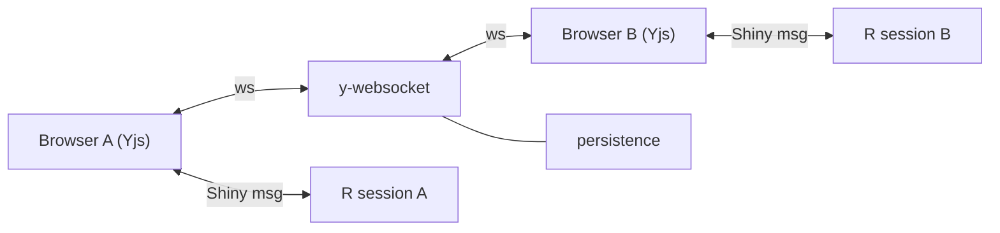

# Board Storage

Board storage is a **blockr concern**, not a blockyard concern. Blockyard
does not store, read, or mediate access to board data. Its role is limited
to:

1. Authenticating users (OIDC)
2. Injecting credentials into the R session (access token + env vars)
3. Running the app

The choice of storage backend, the data model, the sharing semantics,
and the path layout are all owned by blockr.

## Requirements

A board is a JSON string. The storage backend must support:

- **Per-user scoping.** Each user sees only their own boards by default.
- **Targeted sharing.** User A can grant user B read access to a specific
  board. User B can fork (copy to their own space).
- **CRUD.** Save, load, list, delete.
- **Versioning.** Each save creates a new version; loading retrieves the
  most recent version.

## Recommended Backend: PostgreSQL with Vault-issued Credentials

PostgreSQL with Row-Level Security (RLS) enforced at the database
level. Each user maps to a dedicated PG role (`user_<sub>`); RLS
policies filter rows by `current_user`. The R app connects to
PostgreSQL directly, using per-user credentials issued by vault's
`database` secrets engine. No middleware sits between R and the
database at runtime.

Blockyard's runtime involvement is limited to:

1. Provisioning the schema (via its own migration system —
   `golang-migrate` with embedded SQL files).
2. Creating the per-user PG role on first login and registering it
   with vault's `database` static-role feature for password rotation.
3. Deactivating the role when the user is deactivated.

After session bootstrap, the R app talks directly to vault (for
credential issuance and renewal) and PostgreSQL (for data operations).
Blockyard is neither in the data path nor the auth path at runtime.

For installations that outgrow per-user PG connections (typically
when `max_connections` becomes a bottleneck, beyond a few hundred
concurrent sessions), see [Scaling Out](#scaling-out) below.

### Why This Combination

- **Vault-issued database credentials.** The R app already has a
  vault token (existing credential injection). It requests PG
  credentials from vault on demand and renews them before expiry.
  Direct OIDC access token pass-through to a token-validating API
  layer is not viable because Shiny's WebSocket architecture
  provides no mechanism to refresh HTTP headers mid-session; pulling
  credentials from vault sidesteps this entirely because R pulls
  when it needs them.
- **Database-enforced access control.** RLS policies are evaluated
  by PostgreSQL against the connected role (`current_user`).
  Authorization is PostgreSQL's responsibility — there is no
  intermediate service to trust, no JWT validation layer to keep
  hardened.
- **Native rotation and TLS.** Vault's database engine handles
  credential rotation. TLS from R to PostgreSQL is standard PG
  client behavior. Both are well-worn paths, neither requires
  sidecar proxies.
- **Sharing is native SQL.** A `board_shares` table with RLS
  policies handles targeted per-user sharing. No storage-backend-
  specific ACL APIs to learn.
- **Blockyard out of the runtime trust chain.** At runtime, auth
  is between vault (credential issuance) and PostgreSQL (access
  enforcement). A compromised blockyard affects new logins and
  re-bootstraps, not data access on already-active sessions.
- **Fewer moving parts.** No middleware service, no JWKS
  distribution, no JWT validation code to maintain.

### Architecture


Blockyard is not in this path. The R app talks directly to vault
(for credential issuance and renewal) and PostgreSQL (for data
operations). The vault↔PG link is used by vault's database engine
to provision and rotate per-user credentials; it is not on the
runtime query path.

### Schema

Board identity and access control are separated from versioned data.
The `boards` table holds metadata and sharing semantics; the
`board_versions` table holds immutable snapshots. This ensures ACL
settings and tags are per-board, not per-version — sharing a board
means sharing all its versions.

```sql
-- Group role for board-storage access. Each per-user role
-- (user_<sub>) is granted membership in this group at provisioning
-- time by vault's database engine.
CREATE ROLE blockr_user NOLOGIN;
GRANT USAGE ON SCHEMA public TO blockr_user;

-- Board identity and metadata
CREATE TABLE boards (
    id          UUID PRIMARY KEY DEFAULT gen_random_uuid(),
    owner       NAME NOT NULL DEFAULT current_user,
    board_id    TEXT NOT NULL,
    acl_type    TEXT NOT NULL DEFAULT 'private'
                CHECK (acl_type IN ('private', 'public', 'restricted')),
    tags        TEXT[] DEFAULT '{}',
    created_at  TIMESTAMPTZ DEFAULT now(),
    updated_at  TIMESTAMPTZ DEFAULT now(),
    UNIQUE (owner, board_id)
);

-- Versioned board data
CREATE TABLE board_versions (
    id          UUID PRIMARY KEY DEFAULT gen_random_uuid(),
    owner       NAME NOT NULL DEFAULT current_user,
    board_id    TEXT NOT NULL,
    data        JSONB NOT NULL,
    metadata    JSONB NOT NULL DEFAULT '{}'::jsonb,
    created_at  TIMESTAMPTZ DEFAULT now(),
    FOREIGN KEY (owner, board_id)
        REFERENCES boards(owner, board_id) ON DELETE CASCADE
);

CREATE INDEX idx_board_versions_lookup
    ON board_versions(owner, board_id, created_at DESC);

-- Sharing (for restricted ACL)
CREATE TABLE board_shares (
    owner        NAME NOT NULL DEFAULT current_user,
    board_id     TEXT NOT NULL,
    shared_with  NAME NOT NULL,
    created_at   TIMESTAMPTZ DEFAULT now(),
    PRIMARY KEY (owner, board_id, shared_with),
    FOREIGN KEY (owner, board_id)
        REFERENCES boards(owner, board_id) ON DELETE CASCADE
);

GRANT SELECT, INSERT, UPDATE, DELETE
    ON boards, board_versions, board_shares
    TO blockr_user;
```

The `owner` column is typed `NAME` (PostgreSQL's internal identifier
type, what `current_user` returns) and defaults to `current_user`,
so every insert records the connecting role automatically. RLS
policies compare `owner = current_user` — no claim extraction
plumbing, no identity helper function.

Three visibility modes via `acl_type`:

| `acl_type` | Who can read |
|---|---|
| `private` | Owner only. Default. |
| `public` | Any authenticated role (any `user_<sub>`). |
| `restricted` | Owner + users listed in `board_shares`. |

### RLS Policies

```sql
-- boards
ALTER TABLE boards ENABLE ROW LEVEL SECURITY;

CREATE POLICY owner_all ON boards
  USING (owner = current_user)
  WITH CHECK (owner = current_user);

CREATE POLICY public_read ON boards FOR SELECT
  USING (acl_type = 'public');

CREATE POLICY restricted_read ON boards FOR SELECT
  USING (acl_type = 'restricted' AND EXISTS (
      SELECT 1 FROM board_shares
      WHERE board_shares.owner = boards.owner
      AND board_shares.board_id = boards.board_id
      AND board_shares.shared_with = current_user
  ));

-- board_versions (inherits access from parent board)
ALTER TABLE board_versions ENABLE ROW LEVEL SECURITY;

CREATE POLICY version_owner ON board_versions
  USING (owner = current_user)
  WITH CHECK (owner = current_user);

CREATE POLICY version_public ON board_versions FOR SELECT
  USING (EXISTS (
      SELECT 1 FROM boards
      WHERE boards.owner = board_versions.owner
      AND boards.board_id = board_versions.board_id
      AND boards.acl_type = 'public'
  ));

CREATE POLICY version_restricted ON board_versions FOR SELECT
  USING (EXISTS (
      SELECT 1 FROM boards b
      JOIN board_shares bs
          ON b.owner = bs.owner AND b.board_id = bs.board_id
      WHERE b.owner = board_versions.owner
      AND b.board_id = board_versions.board_id
      AND b.acl_type = 'restricted'
      AND bs.shared_with = current_user
  ));

-- board_shares
ALTER TABLE board_shares ENABLE ROW LEVEL SECURITY;

CREATE POLICY shares_owner ON board_shares
  USING (owner = current_user)
  WITH CHECK (owner = current_user);

CREATE POLICY shares_see_own ON board_shares FOR SELECT
  USING (shared_with = current_user);
```

### Operations from R

The R app uses `DBI` + `RPostgres` to talk to PostgreSQL directly,
with per-user credentials obtained from vault.

```
Save:    INSERT INTO boards (board_id, acl_type, tags) VALUES (...)
         INSERT INTO board_versions (board_id, data, metadata) VALUES (...)
Load:    SELECT data, metadata FROM board_versions
         WHERE board_id = $id
         ORDER BY created_at DESC LIMIT 1
List:    SELECT * FROM boards            (RLS filters automatically)
Delete:  DELETE FROM boards WHERE board_id = $id
Share:   INSERT INTO board_shares (board_id, shared_with) VALUES (...)
Tags:    UPDATE boards SET tags = $tags WHERE board_id = $id
Fork:    SELECT from shared board; INSERT as new row
```

All inserts default `owner = current_user`, so the R app does not
need to pass it. RLS scopes all reads to the current user's
visible rows, so WHERE clauses can omit `owner` for own-data
queries.

### Obtaining DB Credentials from Vault

The R app uses its existing vault token and assigned PG role name
(both injected by blockyard) to fetch the current password from
vault's `database` static-creds endpoint:

```r
vault_token <- session$request$HTTP_X_BLOCKYARD_VAULT_TOKEN
vault_addr  <- Sys.getenv("VAULT_ADDR")
pg_role     <- session$request$HTTP_X_BLOCKYARD_PG_ROLE

resp <- httr2::request(
    paste0(vault_addr, "/v1/database/static-creds/", pg_role)
  ) |>
  httr2::req_headers("X-Vault-Token" = vault_token) |>
  httr2::req_perform()

creds <- httr2::resp_body_json(resp)$data
# creds$username, creds$password, creds$ttl

con <- DBI::dbConnect(
    RPostgres::Postgres(),
    host = Sys.getenv("PGHOST"), port = 5432, dbname = "blockyard",
    user = creds$username, password = creds$password,
    sslmode = "require"
)
```

Vault rotates the password on its configured schedule (default 24h).
When a connection fails due to a rotated password, R re-fetches
credentials from vault and reconnects. The vault token itself is
renewable by the R app via `POST /auth/token/renew-self`.

### Vault Database Engine Configuration

One-time setup on vault:

- Enable the `database` secrets engine.
- Configure a connection to PostgreSQL using a PG role with
  `CREATEROLE` privileges (for managing `user_<sub>` roles).

Per-user provisioning (blockyard, on first login):

- `CREATE ROLE "user_<sub>" LOGIN PASSWORD '<temp>';`
- `GRANT blockr_user TO "user_<sub>";`
- Register the static role with vault, pointing at the PG username
  and setting a rotation period (e.g. `24h`). Vault immediately
  rotates to a fresh password.
- Update the user's vault policy to allow reading that static-creds
  endpoint only:

```
path "database/static-creds/user_<sub>" {
    capabilities = ["read"]
}
```

The `sub` identifier is normalized (lowercased, non-alphanumeric
characters replaced) to form a valid PG role name. The normalized
name is stored server-side and injected into the R session as
`X-Blockyard-PG-Role`.

### Example Docker Compose Services

```yaml
postgres:
  image: postgres:17
  environment:
    POSTGRES_DB: blockyard
    POSTGRES_USER: blockyard
    POSTGRES_PASSWORD: dev-password
  volumes:
    - ./init.sql:/docker-entrypoint-initdb.d/init.sql:ro
    - pgdata:/var/lib/postgresql/data
  healthcheck:
    test: ["CMD", "pg_isready"]
    interval: 5s
    retries: 10
```

`init.sql` bootstraps the schema, the `blockr_user` group role,
and RLS policies (the SQL shown earlier). Per-user PG roles are
not created here — blockyard creates them on first login and
registers them with vault.

The init container configures vault's `database` secrets engine:
connection to PostgreSQL with `CREATEROLE` privileges, and a
policy template that grants each user read access to their own
`static-creds/user_<sub>` path. No JWKS download, no Identity
OIDC setup, no PostgREST container.

## Scaling Out

The vault-creds model establishes one PostgreSQL connection per
active R session. PostgreSQL's `max_connections` is the ceiling —
tunable to a few hundred in production, bounded ultimately by
backend process memory (~10 MB per connection). On a single
server, R worker memory hits the HW wall long before connection
count does, so this ceiling rarely matters.

For multi-node deployments (typically Kubernetes, hundreds to
thousands of concurrent R sessions), the migration path is a thin
API shim with a shared PG connection pool:

- R authenticates to the shim with its vault token. The shim
  verifies it via vault's `auth/token/lookup-self` and resolves
  the user's PG role.
- Shim opens one of its pooled PG connections, runs
  `SET LOCAL ROLE "user_<sub>"` inside a transaction, and executes
  the query. RLS still enforces via `current_user`.
- No schema changes. No change to how R obtains its vault token.

Alternative: `pgjwt` validation directly in the DB (shim passes a
vault-issued JWT, `pgjwt` verifies against vault's JWKS, RLS reads
claims from `current_setting`). Heavier migration — changes the
role-identity story from native PG auth to claim-driven — but
preserves the "DB is the single enforcement point" property
without per-user PG connections.

The vault-creds setup doesn't lock in either path; the shim is
additive.

## Alternative Backends

The PostgreSQL + vault-creds combination is recommended because it
keeps all auth enforcement inside PostgreSQL and requires no
middleware service. However, blockr is storage-agnostic. Any
backend works if:

1. The R app can obtain credentials for it (typically from vault).
2. The backend supports per-user scoping and sharing.

For backends that require per-user credentials (S3, PocketBase,
Gitea, etc.), the operator provisions credentials and stores them
in OpenBao at `secret/data/users/{sub}/apikeys/{service}`.
Blockyard's existing credential injection (vault token +
`VAULT_ADDR`) delivers them to the R app at runtime. No blockyard
code changes are needed.

| Backend                  | Provisioning                      | Sharing model             | Versioning          |
|--------------------------|-----------------------------------|---------------------------|---------------------|
| PostgreSQL + vault-creds | Per-user role via vault DB engine | RLS + shares table        | Via schema          |
| PocketBase               | User + token → vault              | Record-level rules        | Manual              |
| S3 / MinIO               | Access key → vault                | Bucket policies (limited) | Via object versions |
| Gitea                    | User + token → vault              | Collaborators (per-repo)  | Git history         |
| Vault KV v2              | None (existing token)             | Broadcast only            | Built-in            |

## Rack API Contract

The rack API is a backend-agnostic interface for board storage in
blockr. It defines the operations any storage backend must support,
and uses S3 dispatch to route calls to backend-specific
implementations. The contract below specifies what backends must
implement; the internal behavior of each operation (error handling,
notifications, caching) is the rack layer's responsibility.

### Operations

All rack operations at a glance, grouped by concern. Operations that
produce board references dispatch on `backend`; operations that
consume them dispatch on `id`.

```r
# Board CRUD
rack_list(backend, ..., tags = NULL)          → list of rack_id
rack_save(backend, data, ..., name,
          metadata = list())                  → rack_id (with version)
rack_load(id, backend)                        → board data (R list)
rack_delete(id, backend)                      → invisible
rack_purge(id, backend)                       → invisible

# Versioning
rack_info(id, backend)                        → data.frame(version, created, hash)

# Tags
rack_tags(id, backend)                        → character vector
rack_set_tags(id, backend, tags)              → invisible

# Visibility
rack_acl(id, backend)                         → "private" | "restricted" | "public"
rack_set_acl(id, backend, acl_type)           → invisible

# Sharing
rack_share(id, backend, with_sub)             → invisible
rack_unshare(id, backend, with_sub)           → invisible
rack_shares(id, backend)                      → data.frame(sub, name, email, shared_at)

# User discovery
rack_find_users(backend, query)               → data.frame(id, name, email)

# Capabilities
rack_capabilities(backend)                    → named list of logicals

# Board reference accessors (on rack_id)
display_name(id)                              → character
last_saved(id, backend)                       → POSIXct
```

Detailed behavior, return values, and backend-specific implementation
notes follow in the sections below.

### Board References

A `rack_id` is an opaque reference to a board (and optionally a
specific version). Each backend defines its own ID shape — callers
treat IDs as opaque tokens. IDs are produced by `rack_list` and
`rack_save`, consumed by all other operations.

Examples of backend-specific shapes:

| Backend | Fields |
|---|---|
| Pins (local) | name, version |
| Pins (Connect) | user, name, version |
| PocketBase | record_id, name |
| PostgreSQL | owner, board_id |

Accessor generics on `rack_id`:

- `display_name(id)` — human-readable label for UI display
- `last_saved(id, backend)` — timestamp of most recent version

### Capabilities

Backends declare which features they support via
`rack_capabilities(backend)`. The UI checks capabilities before
rendering feature-specific controls. Backends that don't support a
feature should error explicitly when the corresponding operation is
called.

| Capability       | Description                              |
|------------------|------------------------------------------|
| `versioning`     | Multiple versions per board              |
| `tags`           | Per-board labels for filtering           |
| `metadata`       | Per-version key-value pairs              |
| `sharing`        | Grant/revoke per-user access             |
| `visibility`     | ACL modes (private/restricted/public)    |
| `user_discovery` | Search for users to share with           |

### Board CRUD

```
rack_list(backend, ..., tags)                → list of rack_id
rack_save(backend, data, ..., name, metadata) → rack_id (with version)
rack_load(id, backend)                       → board data (R list)
rack_delete(id, backend)                     → delete single version
rack_purge(id, backend)                      → delete board + all versions
```

`rack_list` dispatches on `backend`. Returns boards the current user
owns or has been shared with. Optional `tags` parameter filters by
tag.

`rack_save` dispatches on `backend`. Creates a new version of the
board. The `metadata` parameter is a named list of arbitrary
key-value pairs (see [Data and Metadata](#data-and-metadata)).
Returns a `rack_id` with the newly created version.

`rack_load` dispatches on `id`. If the ID includes a version, loads
that specific version. Otherwise loads the latest. Reads
`metadata$format` to dispatch deserialization.

`rack_delete` dispatches on `id`. If the ID includes a version,
deletes that version. If no version, deletes the most recent.

`rack_purge` dispatches on `id`. Deletes the board and all its
versions, shares, and tags.

### Versioning

```
rack_info(id, backend)  → data.frame(version, created, hash)
```

Dispatches on `id`. Returns the version history for a board, sorted
newest-first. Backends that don't support versioning return a
single-row data frame representing the current state.

### Data and Metadata

Each version stores two things:

- **data** — the board content, an opaque blob. Currently JSON;
  future formats (binary, CRDT) are possible. The rack layer
  handles serialization via `serialize_board()` / `restore_board()`.
- **metadata** — a named list of arbitrary key-value pairs.
  Open-ended so new keys can be added without schema changes.

Currently defined metadata keys:

| Key      | Purpose                                           |
|----------|---------------------------------------------------|
| `format` | Serialization format (`"v1"`) for deserialization |

Future keys (blockr version, description, author notes, etc.) slot
in without backend changes.

Backend storage:

| Backend    | metadata storage                                    |
|------------|-----------------------------------------------------|
| Pins       | `pin_upload(..., metadata = list(format = "v1"))` — stored in pin metadata, read via `pin_meta(...)$user` |
| PostgreSQL | `metadata JSONB` column on `board_versions`         |
| PocketBase | `metadata` JSON field on `board_versions` collection |

### Tags

```
rack_tags(id, backend)            → character vector
rack_set_tags(id, backend, tags)  → replace all tags
```

Tags are per-board (not per-version) labels for discovery and
filtering. `rack_list` accepts an optional `tags` parameter to
filter results.

Backend storage:

| Backend    | tags storage                                        |
|------------|-----------------------------------------------------|
| Pins       | Pin tags (merged with blockr session marker tags)   |
| PostgreSQL | `tags TEXT[]` column on `boards` table              |
| PocketBase | `tags` JSON field on `boards` collection            |

Note: the pins backend uses special session marker tags
(`blockr_session_tags()`) to distinguish blockr boards from other
pins. These are a pins-specific concern — database backends don't
need them because the `boards` table contains only blockr boards by
definition. The rack layer handles merging/stripping session markers
transparently.

### Visibility

```
rack_acl(id, backend)                   → "private" | "restricted" | "public"
rack_set_acl(id, backend, acl_type)
```

Three modes:

| Mode         | Who can read                        |
|--------------|-------------------------------------|
| `private`    | Owner only. Default.                |
| `restricted` | Owner + explicitly shared users.    |
| `public`     | Any authenticated user.             |

Backends that don't support visibility always return `"private"`.

Backend implementation:

| Backend    | Mechanism                                            |
|------------|------------------------------------------------------|
| PostgreSQL | `acl_type` column on `boards`, enforced by RLS       |
| PocketBase | `acl_type` field on `boards`, enforced by record rules |
| Connect    | Content access type via Connect API                  |
| Local pins | Always private (not supported)                       |

### Sharing

```
rack_share(id, backend, with_sub)
rack_unshare(id, backend, with_sub)
rack_shares(id, backend)       → data.frame(sub, name, email, shared_at)
```

All dispatch on `id`. Only the board owner can share/unshare.
`rack_shares` returns information about users who currently have
access.

Backend implementation:

| Backend    | Share mechanism                                      |
|------------|------------------------------------------------------|
| PostgreSQL | CRUD on `board_shares` table via direct SQL          |
| PocketBase | PATCH `shared_with` multi-relation field on board    |
| Connect    | `POST/DELETE /v1/content/{guid}/permissions`         |
| Local pins | Not supported (error)                                |

### User Discovery

```
rack_find_users(backend, query)  → data.frame(id, name, email)
```

Dispatches on `backend`. Searches for users matching `query`
(prefix/substring match on name or email). Used by the sharing UI
to let users find others to share with.

| Backend    | Mechanism                                            |
|------------|------------------------------------------------------|
| Connect    | `GET /v1/users?prefix=...` — available to any authenticated user |
| PocketBase | `GET /api/collections/users/records?filter=...`      |
| PostgreSQL | `SELECT ... FROM users WHERE name ILIKE '%query%'` — rows recorded by blockyard on first login |
| Local pins | Not supported                                        |

### Backend Summary

| Feature        | Pins (local) | Pins (Connect) | PocketBase | PostgreSQL    |
|----------------|:---:|:---:|:---:|:---:|
| Board CRUD     | ✓ | ✓ | ✓ | ✓ |
| Versioning     | ✓ | ✓ | ✓ | ✓ |
| Metadata       | ✓ | ✓ | ✓ | ✓ |
| Tags           | ✓ | ✓ | ✓ | ✓ |
| Visibility     | — | via Connect ACL | ✓ | ✓ (RLS) |
| Sharing        | — | via Connect API | ✓ | ✓ (RLS) |
| User discovery | — | via Connect API | ✓ | ✓ (users table) |

## Appendix: Real-Time Collaborative Editing

A feasibility sketch for multi-user real-time board editing. Out of
scope for v2 but relevant to storage design decisions made now.

### Approach

A board decomposes naturally into CRDT-friendly structures:

- **Set of blocks** → add-wins set (concurrent add + remove of the
  same block resolves to "block survives").
- **Block parameters** → last-writer-wins register per field.
- **Connections** → add-wins set of edges.
- **Layout positions** → last-writer-wins register per block.

Libraries like [Yjs](https://github.com/yjs/yjs) and
[Automerge](https://automerge.org/) implement these primitives as
document CRDTs with proven sync protocols.

### Architecture

Yjs runs in the browser (JavaScript). R does not need CRDT logic —
it exchanges granular operations with the Yjs document over Shiny's
existing custom-message channel (the same pattern blockr.dock uses
with dockview for layout state). A [y-websocket][yws] server relays
changes between browsers.

[yws]: https://github.com/yjs/y-websocket



Outgoing: user edits a parameter → R sends a granular operation to
JS → JS applies it to the Yjs doc → Yjs syncs to other browsers.

Incoming: Yjs observer fires → JS sends the operation to R via
`Shiny.setInputValue()` → R updates reactive state → UI updates.

### Storage Implications

The Yjs document is persisted as an opaque binary encoding, not
application-level JSON. This creates a potential separation between
two kinds of board data:

- **Static save-points.** Explicit user-initiated snapshots ("save
  board"). These remain `JSONB` in `board_versions` — a materialized
  view of the board state at a point in time. Useful for listing,
  search, forking, and restoring boards outside a live session.
- **Dynamic sync state.** The live CRDT document used during
  collaborative editing. Stored as `BYTEA` (or in a separate system
  entirely) and managed by the Yjs persistence layer, not the
  board-storage schema.

Whether these live in the same table, separate tables, or separate
systems is TBD. The key constraint: the `board_versions` table and
its CRUD operations remain valid for single-user save/load.
Real-time sync adds a parallel storage path, it does not replace
the existing one.

### Auth Integration

The y-websocket server must verify the user's identity and check
board permissions (owner or shared-with) before granting access to
a document. This likely requires a direct query against the
`boards` / `board_shares` tables using the server's own PG role
(which would have read access for permission checks). The
`board_shares` model would also need to support write access, not
just read.

### Open Conflict Semantics

- User A deletes a block while User B edits its parameters — does the
  block survive (add-wins) or disappear (delete-wins)?
- Concurrent connection additions could create cycles in a DAG.
  CRDTs do not enforce structural invariants — application-level
  validation is needed.
- CRDT documents grow over time (tombstones). A compaction / garbage
  collection strategy is needed for long-lived boards.
