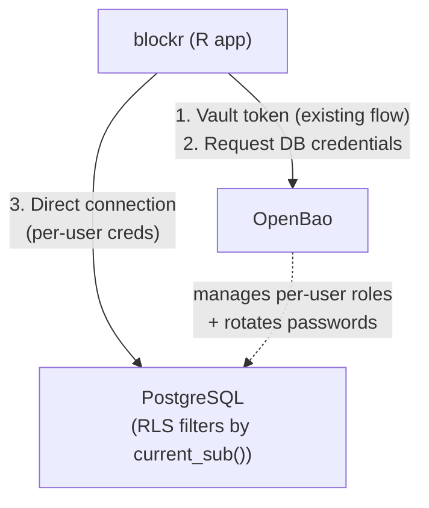
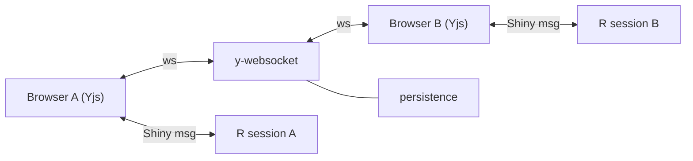

# Board Storage

Board storage is split across blockyard, PostgreSQL, and blockr along
control-plane / data-plane lines:

- **Blockyard** owns the control plane: schema migrations, per-user
  role provisioning, vault integration. It is not in the data path
  at runtime.
- **PostgreSQL** is the data store and the enforcement point: data
  lives in PG, RLS policies filter by caller identity (resolved via
  `current_sub()` from the connecting role) at query time.
- **Blockr** owns the R-side client API: DBI queries, sharing UI,
  serialization.

Blockyard's responsibilities in the storage lifecycle:

1. Authenticating users via OIDC.
2. Provisioning the schema at deploy time (migrations shipped in
   `internal/db/migrations/postgres/`) and per-user PG roles on
   first login.
3. Issuing credentials via vault and injecting references into
   the R session.
4. Running the app.

At runtime, R talks directly to vault (for credential issuance
and renewal) and PostgreSQL (for data operations); blockyard is
not on that path. Blockr stays storage-agnostic at the rack API
layer — it just happens to have a PostgreSQL-backed implementation
of `rack_*` operations for this backend.

## Requirements

A board is a JSON string. The storage backend must support:

- **Per-user scoping.** Each user sees only their own boards by default.
- **Targeted sharing.** User A can grant user B read access to a specific
  board. User B can fork (copy to their own space).
- **CRUD.** Save, load, list, delete.
- **Versioning.** Each save creates a new version; loading retrieves the
  most recent version.

## Recommended Backend: PostgreSQL with Vault-issued Credentials

PostgreSQL with Row-Level Security (RLS) enforced at the database
level. Each user maps to a dedicated PG role (`user_<entity-id>`); RLS
policies filter rows by caller identity (resolved via `current_sub()`,
see [RLS Policies](#rls-policies)). The R app connects to PostgreSQL
directly, using per-user credentials issued by vault's `database`
secrets engine. No middleware sits between R and the database at
runtime.

Blockyard's provisioning responsibilities for this backend:

1. Running the schema migrations (via `golang-migrate` with
   embedded SQL files in `internal/db/migrations/postgres/`).
2. Creating the per-user PG role on first login and registering it
   with vault's `database` static-role feature for password rotation.
3. Deactivating the role when the user is deactivated.

At runtime, R talks directly to vault (for credential issuance and
renewal) and PostgreSQL (for data operations); blockyard is
neither in the data path nor the auth path.

For installations that outgrow per-user PG connections (typically
when `max_connections` becomes a bottleneck, beyond a few hundred
concurrent sessions), see [Scaling Out](#scaling-out) below.

### Why This Combination

- **Vault-issued database credentials.** The R app already has a
  vault token (existing credential injection). It requests PG
  credentials from vault on demand and renews them before expiry.
  Direct OIDC access token pass-through to a token-validating API
  layer is not viable because Shiny's WebSocket architecture
  provides no mechanism to refresh HTTP headers mid-session; pulling
  credentials from vault sidesteps this entirely because R pulls
  when it needs them.
- **Database-enforced access control.** RLS policies are evaluated
  by PostgreSQL against the caller's identity — `current_sub()` maps
  the connecting role (`session_user`) back to an OIDC sub via
  `users.pg_role`. Authorization is PostgreSQL's responsibility —
  there is no intermediate service to trust, no JWT validation layer
  to keep hardened.
- **Native rotation and TLS.** Vault's database engine handles
  credential rotation. TLS from R to PostgreSQL is standard PG
  client behavior. Both are well-worn paths, neither requires
  sidecar proxies.
- **Sharing is native SQL.** A `board_shares` table with RLS
  policies handles targeted per-user sharing. No storage-backend-
  specific ACL APIs to learn.
- **Blockyard out of the runtime trust chain.** At runtime, auth
  is between vault (credential issuance) and PostgreSQL (access
  enforcement). A compromised blockyard affects new logins and
  re-bootstraps, not data access on already-active sessions.
- **Fewer moving parts.** No middleware service, no JWKS
  distribution, no JWT validation code to maintain.

### Architecture



Blockyard is not in this path. The R app talks directly to vault
(for credential issuance and renewal) and PostgreSQL (for data
operations). The vault↔PG link is used by vault's database engine
to provision and rotate per-user credentials; it is not on the
runtime query path.

### Role Model

Board storage uses four distinct PostgreSQL role kinds:

| Role | Purpose | Attributes |
|---|---|---|
| `vault_db_admin` | Vault's `database` engine connection. Rotates per-user passwords. | `LOGIN`, `CREATEROLE`, `NOINHERIT`; `ADMIN OPTION` on each `user_<entity-id>` granted at provisioning time |
| `blockyard_admin` | Convention role created at startup for blockyard's control-plane connection (see note below). | `NOLOGIN`, `NOINHERIT`, `CREATEROLE`; `ADMIN OPTION` on `blockr_user` with `INHERIT FALSE, SET FALSE` |
| `blockr_user` | Group role holding data privileges on the board tables. | `NOLOGIN`; `SELECT`/`INSERT`/`UPDATE`/`DELETE` on board tables + `SELECT` on `users` |
| `user_<entity-id>` | Per-user role for R session connections, created on first login. | `LOGIN`, member of `blockr_user` with `INHERIT TRUE, SET FALSE` |

The separation is load-bearing:

- `blockyard_admin` has role-creation power but no data access.
  `NOINHERIT` blocks it from inheriting `blockr_user`; `SET FALSE`
  on the group grant also blocks `SET ROLE blockr_user`. A
  compromised admin connection can provision and deactivate user
  roles, not read or write boards.
- `user_<entity-id>` has data access but no role-creation power
  and no `ADMIN OPTION` on anything. Its `blockr_user` grant uses
  `SET FALSE` too — this blocks `SET ROLE blockr_user`, which
  would otherwise let a user create rows owned by the shared
  group role and break the `owner_sub = current_sub()` invariant
  RLS depends on.
- `vault_db_admin` has `CREATEROLE` for password rotation but is
  never a member of `blockr_user`, so has no data path.

User-side escalation attempts an R script connecting as
`user_<entity-id>` might try — all denied:

| Attempt | Result |
|---|---|
| `CREATE ROLE evil` | no `CREATEROLE` |
| `GRANT pg_read_all_data TO "user_<entity-id>"` | no `ADMIN OPTION` on target |
| `SET ROLE blockr_user` | `SET FALSE` on the grant |
| `SET ROLE blockyard_admin` | not a member |
| `ALTER ROLE "user_other" PASSWORD '…'` | no `ADMIN OPTION` on target |

This scoping requires **PostgreSQL 16 or later**. On PG15 and
earlier, `CREATEROLE` implied the power to alter any non-superuser
role's password and grant itself arbitrary role memberships — the
scoping above does not hold. Blockyard's preflight refuses to
start when `database.board_storage = true` against a PG15 or older
cluster.

**Note on `blockyard_admin` usage.** Blockyard creates the role
idempotently at startup but does not yet connect as it — the
existing `database.url` / `database.vault_role` connection runs
provisioning SQL directly. Those credentials must hold
`CREATEROLE` and `ADMIN OPTION` on `blockr_user`. Operators who
want to narrow blockyard's own privilege surface can `ALTER ROLE
blockyard_admin LOGIN PASSWORD '…'` and repoint blockyard at it;
automating this wiring is a follow-up.

### Schema

Board identity and access control are separated from versioned data.
The `boards` table holds metadata and sharing semantics; the
`board_versions` table holds immutable snapshots. This ensures ACL
settings, tags, and board-level metadata are per-board, not
per-version — sharing a board means sharing all its versions.

All blockyard-owned objects live in a dedicated `blockyard` schema
(see #283). Runtime connections set `search_path` to
`blockyard, public`; the schema is created by migration 006, which
also moves the core tables (apps, bundles, users, …) over via
`ALTER TABLE … SET SCHEMA`. The tables below are all in the
blockyard schema once 006 lands.

```sql
-- Group role for board-storage access. Each per-user role
-- (user_<entity-id>) is granted membership in this group at
-- provisioning time.
CREATE ROLE blockr_user NOLOGIN;
GRANT USAGE ON SCHEMA blockyard TO blockr_user;

-- Per-user role mapping. Populated by first-login provisioning;
-- NULL for users who haven't yet been provisioned for board storage.
-- current_sub() (below) resolves session_user → sub via this column.
-- Partial unique index allows many NULLs but enforces one user per
-- populated role name.
ALTER TABLE users ADD COLUMN pg_role TEXT;
CREATE UNIQUE INDEX idx_users_pg_role
    ON users(pg_role) WHERE pg_role IS NOT NULL;

-- Board identity and metadata
CREATE TABLE boards (
    id         UUID PRIMARY KEY DEFAULT gen_random_uuid(),
    owner_sub  TEXT NOT NULL REFERENCES users(sub) ON DELETE CASCADE,
    board_id   TEXT NOT NULL
               CHECK (board_id ~ '^[a-z0-9][a-z0-9-]*[a-z0-9]$'
                      AND length(board_id) <= 63),
    name       TEXT NOT NULL
               CHECK (length(name) BETWEEN 1 AND 255),
    acl_type   TEXT NOT NULL DEFAULT 'private'
               CHECK (acl_type IN ('private', 'public', 'restricted')),
    tags       TEXT[] NOT NULL DEFAULT '{}',
    metadata   JSONB NOT NULL DEFAULT '{}'::jsonb,
    UNIQUE (owner_sub, board_id)
);
CREATE INDEX idx_boards_tags ON boards USING GIN (tags);

-- Versioned board data
CREATE TABLE board_versions (
    id         UUID PRIMARY KEY DEFAULT gen_random_uuid(),
    board_ref  UUID NOT NULL REFERENCES boards(id) ON DELETE CASCADE,
    data       JSONB NOT NULL,
    format     TEXT NOT NULL,
    created_at TIMESTAMPTZ NOT NULL DEFAULT now()
);
CREATE INDEX idx_board_versions_lookup
    ON board_versions(board_ref, created_at DESC);

-- Sharing (for restricted ACL)
CREATE TABLE board_shares (
    board_ref       UUID NOT NULL REFERENCES boards(id) ON DELETE CASCADE,
    shared_with_sub TEXT NOT NULL REFERENCES users(sub) ON DELETE CASCADE,
    created_at      TIMESTAMPTZ NOT NULL DEFAULT now(),
    PRIMARY KEY (board_ref, shared_with_sub)
);
CREATE INDEX idx_board_shares_shared_with ON board_shares(shared_with_sub);

-- Invariant: a board always has >= 1 version. Deleting the last
-- version raises `restrict_violation` rather than auto-purging —
-- keeps rack_delete (prune one version) and rack_purge (drop the
-- board) semantically distinct at the DB level.
CREATE FUNCTION prevent_last_version_delete() RETURNS TRIGGER AS $$
BEGIN
    IF (SELECT count(*) FROM board_versions
        WHERE board_ref = OLD.board_ref) = 1 THEN
        RAISE EXCEPTION
            'cannot delete the last version of board %; purge the board instead',
            OLD.board_ref
            USING ERRCODE = 'restrict_violation';
    END IF;
    RETURN OLD;
END;
$$ LANGUAGE plpgsql;

CREATE TRIGGER board_versions_prevent_last_delete
BEFORE DELETE ON board_versions
FOR EACH ROW EXECUTE FUNCTION prevent_last_version_delete();

GRANT SELECT, INSERT, UPDATE, DELETE
    ON boards, board_versions, board_shares
    TO blockr_user;
GRANT SELECT ON users TO blockr_user;
```

Key shape choices:

- **Surrogate UUID PK on `boards`** with composite `UNIQUE (owner_sub,
  board_id)`. The UUID is the FK target for children; the composite
  is the owner-scoped uniqueness constraint. Reserves rename
  flexibility (rename a `board_id` without cascading into child
  rows) even though rename isn't implemented yet.
- **`board_id` + `name` split.** `board_id` is the URL-safe slug
  (lowercase alphanumeric + internal hyphens, length ≤ 63); `name`
  is the free-form display label (length 1..255). No uniqueness on
  `name` — two "Analysis" boards are fine.
- **UUID FK on children** (`board_ref`). No denormalized `owner_sub`
  on `board_versions` or `board_shares` — ownership is a board-level
  fact, reached via EXISTS lookups in RLS.
- **`boards.owner_sub → users(sub) ON DELETE CASCADE`**. User
  deletion cascades into their boards, which cascade into versions
  and shares.
- **`board_shares.shared_with_sub → users(sub) ON DELETE CASCADE`**.
  Target must exist; enforced by the user-discovery flow (shares go
  to users who have logged in).
- **No `created_at` / `updated_at` on `boards`.** Both are derivable
  from `MIN`/`MAX(board_versions.created_at)`. The R API's
  `last_saved()` already uses the version timestamp.
- **`metadata` on `boards`, not `board_versions`.** Avoids the
  "which version's `description` is canonical?" inconsistency.
  Board-level metadata is board-level.
- **Typed `format` on `board_versions`.** The one genuinely
  version-intrinsic field gets a real column rather than a JSONB
  key. Future version-intrinsic fields (e.g. `notes TEXT`) follow
  the same pattern.

Three visibility modes via `acl_type`:

| `acl_type` | Who can read |
|---|---|
| `private` | Owner only. Default. |
| `public` | Any authenticated role (any `user_<entity-id>`). |
| `restricted` | Owner + users listed in `board_shares`. |

### RLS Policies

Policies look up identity via the `current_sub()` helper, which maps
the connecting PG role (`session_user`) back to its OIDC sub via
`users.pg_role`. Using `session_user` rather than `current_user` is
load-bearing: it keeps the mapping stable across `SECURITY DEFINER`
boundaries (where `current_user` flips to the function owner) and
blocks `SET ROLE` from changing the effective identity.

```sql
-- Identity helper. NOLOGIN admin roles have no `users` row, so
-- current_sub() returns NULL for them — which fail-closes every
-- policy that traverses this function.
CREATE FUNCTION current_sub() RETURNS TEXT AS $$
    SELECT sub FROM users WHERE pg_role = session_user
$$ LANGUAGE sql STABLE;

-- Break the cycle between boards.restricted_read (which references
-- board_shares) and board_shares.shares_owner (which would otherwise
-- reference boards) — PG rejects such cycles at query time with
-- "infinite recursion detected in policy". SECURITY DEFINER reads
-- boards as the function owner (bypassing RLS on that table); the
-- predicate is still locked to the caller via current_sub(), so the
-- helper leaks nothing beyond "do I own this board id?", which the
-- caller already knows from their own SELECTs. search_path is
-- pinned to guard against schema-shadow attacks by callers with
-- CREATE on other schemas.
CREATE FUNCTION current_user_owns_board(b_id UUID) RETURNS BOOLEAN AS $$
    SELECT EXISTS (
        SELECT 1 FROM boards
        WHERE id = b_id AND owner_sub = current_sub()
    );
$$ LANGUAGE sql SECURITY DEFINER STABLE
  SET search_path = blockyard, pg_catalog;

-- boards
ALTER TABLE boards ENABLE ROW LEVEL SECURITY;

CREATE POLICY owner_all ON boards
  USING (owner_sub = current_sub())
  WITH CHECK (owner_sub = current_sub());

CREATE POLICY public_read ON boards FOR SELECT
  USING (acl_type = 'public');

CREATE POLICY restricted_read ON boards FOR SELECT
  USING (acl_type = 'restricted' AND EXISTS (
      SELECT 1 FROM board_shares
      WHERE board_shares.board_ref = boards.id
      AND board_shares.shared_with_sub = current_sub()
  ));

-- board_versions — ownership is a board-level fact, reached via
-- EXISTS against `boards`.
ALTER TABLE board_versions ENABLE ROW LEVEL SECURITY;

CREATE POLICY version_owner ON board_versions
  USING (EXISTS (
      SELECT 1 FROM boards
      WHERE boards.id = board_versions.board_ref
      AND boards.owner_sub = current_sub()
  ))
  WITH CHECK (EXISTS (
      SELECT 1 FROM boards
      WHERE boards.id = board_versions.board_ref
      AND boards.owner_sub = current_sub()
  ));

CREATE POLICY version_public ON board_versions FOR SELECT
  USING (EXISTS (
      SELECT 1 FROM boards
      WHERE boards.id = board_versions.board_ref
      AND boards.acl_type = 'public'
  ));

CREATE POLICY version_restricted ON board_versions FOR SELECT
  USING (EXISTS (
      SELECT 1 FROM boards b
      JOIN board_shares bs ON bs.board_ref = b.id
      WHERE b.id = board_versions.board_ref
      AND b.acl_type = 'restricted'
      AND bs.shared_with_sub = current_sub()
  ));

-- board_shares. Owner-side policy goes through current_user_owns_board
-- instead of inlining an EXISTS against `boards`; inlining would
-- close the cycle described above.
ALTER TABLE board_shares ENABLE ROW LEVEL SECURITY;

CREATE POLICY shares_owner ON board_shares
  USING (current_user_owns_board(board_ref))
  WITH CHECK (current_user_owns_board(board_ref));

CREATE POLICY shares_see_own ON board_shares FOR SELECT
  USING (shared_with_sub = current_sub());
```

### Operations from R

The R app uses `DBI` + `RPostgres` to talk to PostgreSQL directly,
with per-user credentials obtained from vault. See
[`examples/hello-postgres/app/app.R`](../../examples/hello-postgres/app/app.R)
for a runnable reference.

```
Save:    INSERT INTO boards (owner_sub, board_id, name) VALUES (
             (SELECT sub FROM users WHERE pg_role = session_user),
             $board_id, $name)
         ON CONFLICT (owner_sub, board_id)
             DO UPDATE SET name = EXCLUDED.name
         RETURNING id;
         INSERT INTO board_versions (board_ref, data, format)
             VALUES ($board_uuid, $data, 'json');
Load:    SELECT v.data FROM board_versions v
         JOIN boards b ON b.id = v.board_ref
         WHERE b.board_id = $board_id
         ORDER BY v.created_at DESC LIMIT 1;
List:    SELECT board_id, name, acl_type, owner_sub FROM boards
         ORDER BY board_id;
Delete:  DELETE FROM board_versions WHERE id = $version_uuid;
Purge:   DELETE FROM boards        WHERE id = $board_uuid;
Share:   INSERT INTO board_shares (board_ref, shared_with_sub)
             VALUES ($board_uuid, $target_sub);
Tags:    UPDATE boards SET tags = $tags WHERE id = $board_uuid;
Fork:    Read source board + latest version, INSERT as a new
         (owner_sub, board_id) tuple with owner_sub set via the
         current_sub() subquery as in Save.
```

`boards.owner_sub` has no default, so inserts must set it explicitly.
The `(SELECT sub FROM users WHERE pg_role = session_user)` subquery
is the safe expression: it resolves identity the same way
`current_sub()` does in RLS, keeping both sides in sync. RLS scopes
all reads to visible rows (own + public + shared), so WHERE clauses
don't need an explicit owner filter. The
`prevent_last_version_delete` trigger refuses a `Delete` that would
leave a board with zero versions — use `Purge` to drop the whole
board instead.

### Obtaining DB Credentials from Vault

Blockyard injects three pieces of per-session context:

- `VAULT_ADDR` — deployment-level env var, where vault is reachable.
- `BLOCKYARD_VAULT_DB_MOUNT` — deployment-level env var matching
  `database.vault_mount` (default `"database"`). R assembles the
  credential path from this; hardcoding `database/` would break
  deployments that mount the engine elsewhere.
- `X-Blockyard-Vault-Token` and `X-Blockyard-Pg-Role` — per-session
  Shiny headers. The token carries the templated
  `blockyard-user-template` policy (see [Vault Policy
  Layout](#vault-policy-layout)); the role is
  `user_<vault-entity-id>`, persisted on `users.pg_role`.

R reads them, fetches creds from vault's static-creds endpoint, then
opens a plain PG connection:

```r
vault_token <- session$request$HTTP_X_BLOCKYARD_VAULT_TOKEN
vault_addr  <- Sys.getenv("VAULT_ADDR")
vault_mount <- Sys.getenv("BLOCKYARD_VAULT_DB_MOUNT", unset = "database")
pg_role     <- session$request$HTTP_X_BLOCKYARD_PG_ROLE

url  <- sprintf("%s/v1/%s/static-creds/%s", vault_addr, vault_mount, pg_role)
resp <- httr2::request(url) |>
  httr2::req_headers("X-Vault-Token" = vault_token) |>
  httr2::req_perform()
creds <- httr2::resp_body_json(resp)$data
# creds$username, creds$password, creds$ttl

con <- DBI::dbConnect(
    RPostgres::Postgres(),
    host     = Sys.getenv("BLOCKYARD_PG_HOST"),
    port     = as.integer(Sys.getenv("BLOCKYARD_PG_PORT", unset = "5432")),
    dbname   = Sys.getenv("BLOCKYARD_PG_DBNAME"),
    user     = creds$username,
    password = creds$password,
    options  = "-c search_path=blockyard",
    sslmode  = "require"
)
```

The `search_path=blockyard` connection option pins unqualified
references to the `blockyard` schema; without it, callers would have
to schema-qualify every table name (`blockyard.boards`, …).

Vault rotates the password on the schedule configured via
`database.vault_rotation_period` (default `24h`). When a connection
fails due to a rotated password, R re-fetches credentials from vault
and reconnects. The vault token is renewable by the R app via
`POST /auth/token/renew-self`.

### Vault Database Engine Configuration

One-time setup on vault (operator-owned, typically in a deploy
script — see
[`examples/hello-postgres/setup.sh`](../../examples/hello-postgres/setup.sh)):

1. Enable the `database` secrets engine at the path named in
   `database.vault_mount` (default `database`).
2. Register a PostgreSQL connection under that mount, named to match
   `database.vault_db_connection`. The connection's admin identity
   is `vault_db_admin` — its `CREATEROLE` + `NOINHERIT` attributes
   are set out-of-band (see [`examples/hello-postgres/init.sql`](../../examples/hello-postgres/init.sql)).
   Set `allowed_roles = ["user_*"]` so blockyard can only define
   static roles in that namespace.
3. Write the two policies below. Attach `blockyard-server` to
   blockyard's own AppRole; attach `blockyard-user-template` to the
   JWT/OIDC auth role that users log in through (so every
   user-issued token carries it).

#### Vault Policy Layout

Two policies on two tokens. This split is the "Blockyard out of the
runtime trust chain" property made concrete: **no single token holds
the union of permissions**.

**`blockyard-server`** (attached to blockyard's AppRole token):

```hcl
# Define per-user DB static roles at first login.
path "database/static-roles/user_*" {
  capabilities = ["create", "read", "update", "delete"]
}
# Read its own admin creds (via database.vault_role, if set).
path "database/static-creds/<blockyard-admin-role>" {
  capabilities = ["read"]
}
# Resolve an OIDC alias to an entity ID at provisioning time.
path "identity/lookup/entity" {
  capabilities = ["update"]
}
# One-time lookup of the OIDC mount accessor at startup.
path "sys/auth" { capabilities = ["read"] }
```

Crucially, `blockyard-server` does **not** include
`database/static-creds/user_*`. Blockyard can define user-scoped
static roles but cannot mint their credentials. A compromised
blockyard token yields role-definition power, not DB-session power
against any user.

**`blockyard-user-template`** (attached to every user's token via
the JWT auth role's `token_policies`):

```hcl
path "database/static-creds/user_{{identity.entity.id}}" {
  capabilities = ["read"]
}
```

Templating is ACL-only — vault resolves
`{{identity.entity.id}}` server-side from the token's own auth
context. Each user's token can read exactly one static-creds path:
its own. Even if R constructed a path for a different user, the
policy check rejects it before the DB engine is consulted.

#### Per-user Provisioning (first-login flow)

On the first successful OIDC login for a user, blockyard (as
`blockyard-server`, with the DB connection from `database.url`)
runs:

1. **Resolve the entity ID.** `POST identity/lookup/entity` with
   `{ "alias_name": <sub>, "alias_mount_accessor": <oidc-accessor> }`
   returns the vault entity UUID for this user. The OIDC mount
   accessor is resolved once at startup (via `GET sys/auth`) and
   cached on the provisioner. The PG role name is
   `user_<entity-id>` — using vault's own identifier for both the
   PG role and the templated policy resolution removes the
   normalization bridge where the two sides could silently
   disagree.
2. **Create the PG role** (idempotent, guarded by
   `SELECT EXISTS(…FROM pg_roles…)`):
   ```sql
   CREATE ROLE "user_<entity-id>" LOGIN PASSWORD '<random>';
   GRANT blockr_user TO "user_<entity-id>"
       WITH INHERIT TRUE, SET FALSE;
   GRANT "user_<entity-id>" TO vault_db_admin WITH ADMIN OPTION;
   ```
   The `INHERIT TRUE, SET FALSE` on `blockr_user` is load-bearing
   (see [Role Model](#role-model)). The `ADMIN OPTION` grant to
   `vault_db_admin` is what PG16+ requires for vault to later
   `ALTER ROLE user_<entity-id> PASSWORD '…'` on its rotation
   schedule.
3. **Register the static role with vault** —
   `POST {mount}/static-roles/user_<entity-id>` with
   `{ "username": "user_<entity-id>", "db_name": "<vault-db-connection>",
     "rotation_period": "<vault_rotation_period>" }`. Vault
   immediately rotates to a fresh password, which `vault_db_admin`
   now has the `ADMIN OPTION` to apply.
4. **Persist the role name.** Blockyard writes `pg_role =
   user_<entity-id>` on the `users` row (the unique index on
   `pg_role WHERE pg_role IS NOT NULL` both enforces the 1:1
   mapping and durably signals that provisioning succeeded).
   `users.pg_role` is injected into the R session on subsequent
   logins as `X-Blockyard-Pg-Role`.

Every step is idempotent and `users.pg_role` is written last, so a
login interrupted between steps replays cleanly — the next login
sees NULL `pg_role` and re-runs from step 1; `CREATE ROLE IF NOT
EXISTS`, repeated GRANTs, and the vault upsert are all no-ops when
state already matches.

**Deactivation.** When an admin deactivates a user, blockyard runs
`ALTER ROLE "user_<entity-id>" NOLOGIN` rather than dropping the
role — dropping would fail once `boards.owner_sub` references it
via the FK from `users(sub)`. Reactivation restores `LOGIN`.

### Example Docker Compose Services

A runnable end-to-end stack lives at
[`examples/hello-postgres/`](../../examples/hello-postgres/) — the
snippets below are excerpts for context; the example has the full
compose file, `setup.sh`, `init.sql`, and R app.


```yaml
postgres:
  image: postgres:17
  environment:
    POSTGRES_DB: blockyard
    POSTGRES_USER: blockyard
    POSTGRES_PASSWORD: dev-password
  volumes:
    - ./init.sql:/docker-entrypoint-initdb.d/init.sql:ro
    - pgdata:/var/lib/postgresql/data
  healthcheck:
    test: ["CMD", "pg_isready"]
    interval: 5s
    retries: 10
```

`init.sql` seeds only `vault_db_admin` — the PG identity vault's DB
secrets engine uses to manage per-user passwords. Everything else
is created by blockyard:

- `blockyard` schema, core tables relocation, `boards` /
  `board_versions` / `board_shares`, `blockr_user` group role, RLS
  policies, `current_sub()` helper, `current_user_owns_board`
  SECURITY DEFINER helper, and `prevent_last_version_delete` trigger
  all land via migration 006 when blockyard runs its migrations at
  startup.
- `blockyard_admin` is created by idempotent Go-side startup SQL,
  guarded by the PG16+ preflight (the `GRANT … WITH INHERIT FALSE,
  SET FALSE` syntax is PG16-only, so it can't live in a migration
  that must stay PG13+ compatible).
- `user_<entity-id>` roles are created by blockyard's first-login
  provisioning flow and registered with vault's DB engine in the
  same transaction (see
  [Per-user Provisioning](#per-user-provisioning-first-login-flow)).

The init container (`setup.sh`) configures vault: enables the
`database` secrets engine, registers the PG connection, and writes
the two policies (`blockyard-server`, `blockyard-user-template`)
described in [Vault Policy Layout](#vault-policy-layout). No JWKS
download, no Identity OIDC provider, no PostgREST container.

## Scaling Out

The vault-creds model establishes one PostgreSQL connection per
active R session. PostgreSQL's `max_connections` is the ceiling —
tunable to a few hundred in production, bounded ultimately by
backend process memory (~10 MB per connection). On a single
server, R worker memory hits the HW wall long before connection
count does, so this ceiling rarely matters.

For multi-node deployments (typically Kubernetes, hundreds to
thousands of concurrent R sessions), the migration path is a thin
API shim with a shared PG connection pool. A naive `SET LOCAL ROLE
"user_<entity-id>"` on a pool connection does **not** work with
the current identity model: `current_sub()` reads `session_user`
(stable across DEFINER + `SET ROLE` boundaries by design), which
stays as the pool role no matter what `SET ROLE` changes
`current_user` to. RLS would fail closed for every pooled request.

Two shapes that do fit:

- **Session-variable identity.** The shim opens a transaction,
  runs `SET LOCAL blockyard.sub = '<user-sub>'`, and RLS reads it
  via a modified `current_sub()` that falls back to
  `current_setting('blockyard.sub', true)`. Shim validates the
  vault token first; it's the shim's responsibility not to set
  that variable on behalf of a user it hasn't authenticated.
  Requires a small migration to add the fallback to `current_sub()`.
- **`pgjwt` in the DB.** Shim passes a vault-issued JWT; `pgjwt`
  verifies against vault's JWKS; `current_sub()` reads the claim
  from `current_setting`. Heavier migration but keeps "DB is the
  single enforcement point" without per-user PG connections.

Either path is additive — the vault-creds setup doesn't lock in a
direction. Neither is implemented today; the practical ceiling
on a single-node deployment is PG `max_connections` (typically
high hundreds), which R worker memory hits first anyway.

## Alternative Backends

The PostgreSQL + vault-creds combination is recommended because it
keeps all auth enforcement inside PostgreSQL and requires no
middleware service. However, blockr's rack API is storage-agnostic.
Any backend works if:

1. The R app can obtain credentials for it.
2. The backend supports per-user scoping and sharing.

Two provisioning models are supported:

- **Blockyard auto-provisions** (the PostgreSQL + vault-creds flow
  above): blockyard creates per-user roles on first login and
  registers them with vault. Requires backend-specific code in
  blockyard.
- **Operator provisions out-of-band** (S3, PocketBase, Gitea,
  etc.): credentials are created externally and stored in OpenBao
  at `secret/data/users/{sub}/apikeys/{service}`. Blockyard's
  existing credential injection (vault token + `VAULT_ADDR`)
  delivers them to the R app at runtime — no blockyard code
  changes needed.

| Backend                  | Provisioning                      | Sharing model             | Versioning          |
|--------------------------|-----------------------------------|---------------------------|---------------------|
| PostgreSQL + vault-creds | Per-user role via vault DB engine | RLS + shares table        | Via schema          |
| PocketBase               | User + token → vault              | Record-level rules        | Manual              |
| S3 / MinIO               | Access key → vault                | Bucket policies (limited) | Via object versions |
| Gitea                    | User + token → vault              | Collaborators (per-repo)  | Git history         |
| Vault KV v2              | None (existing token)             | Broadcast only            | Built-in            |

## Rack API Contract

The rack API is a backend-agnostic interface for board storage in
blockr. It defines the operations any storage backend must support,
and uses S3 dispatch to route calls to backend-specific
implementations. The contract below specifies what backends must
implement; the internal behavior of each operation (error handling,
notifications, caching) is the rack layer's responsibility.

### Operations

All rack operations at a glance, grouped by concern. Operations that
produce board references dispatch on `backend`; operations that
consume them dispatch on `id`.

```r
# Board CRUD
rack_list(backend, ..., tags = NULL)          → list of rack_id
rack_save(backend, data, ..., name,
          metadata = list())                  → rack_id (with version)
rack_load(id, backend)                        → board data (R list)
rack_delete(id, backend)                      → invisible
rack_purge(id, backend)                       → invisible

# Versioning
rack_info(id, backend)                        → data.frame(version, created, hash)

# Tags
rack_tags(id, backend)                        → character vector
rack_set_tags(id, backend, tags)              → invisible

# Visibility
rack_acl(id, backend)                         → "private" | "restricted" | "public"
rack_set_acl(id, backend, acl_type)           → invisible

# Sharing
rack_share(id, backend, with_sub)             → invisible
rack_unshare(id, backend, with_sub)           → invisible
rack_shares(id, backend)                      → data.frame(sub, name, email, shared_at)

# User discovery
rack_find_users(backend, query)               → data.frame(id, name, email)

# Capabilities
rack_capabilities(backend)                    → named list of logicals

# Board reference accessors (on rack_id)
display_name(id)                              → character
last_saved(id, backend)                       → POSIXct
```

Detailed behavior, return values, and backend-specific implementation
notes follow in the sections below.

### Board References

A `rack_id` is an opaque reference to a board (and optionally a
specific version). Each backend defines its own ID shape — callers
treat IDs as opaque tokens. IDs are produced by `rack_list` and
`rack_save`, consumed by all other operations.

Examples of backend-specific shapes:

| Backend | Fields |
|---|---|
| Pins (local) | name, version |
| Pins (Connect) | user, name, version |
| PocketBase | record_id, name |
| PostgreSQL | UUID (`boards.id`); optional version UUID |

Accessor generics on `rack_id`:

- `display_name(id)` — human-readable label for UI display
- `last_saved(id, backend)` — timestamp of most recent version

### Capabilities

Backends declare which features they support via
`rack_capabilities(backend)`. The UI checks capabilities before
rendering feature-specific controls. Backends that don't support a
feature should error explicitly when the corresponding operation is
called.

| Capability       | Description                              |
|------------------|------------------------------------------|
| `versioning`     | Multiple versions per board              |
| `tags`           | Per-board labels for filtering           |
| `metadata`       | Per-board key-value pairs                |
| `sharing`        | Grant/revoke per-user access             |
| `visibility`     | ACL modes (private/restricted/public)    |
| `user_discovery` | Search for users to share with           |

### Board CRUD

```
rack_list(backend, ..., tags)                → list of rack_id
rack_save(backend, data, ..., name, metadata) → rack_id (with version)
rack_load(id, backend)                       → board data (R list)
rack_delete(id, backend)                     → delete single version
rack_purge(id, backend)                      → delete board + all versions
```

`rack_list` dispatches on `backend`. Returns boards the current user
owns or has been shared with. Optional `tags` parameter filters by
tag.

`rack_save` dispatches on `backend`. Creates a new version of the
board. The `metadata` parameter is a named list of arbitrary
key-value pairs attached to the board (not the version — see
[Data and Metadata](#data-and-metadata)). On first save, a board
row is created with this metadata; subsequent saves add new
versions under the same board. Returns a `rack_id` with the newly
created version.

`rack_load` dispatches on `id`. If the ID includes a version, loads
that specific version. Otherwise loads the latest. Reads the
version's `format` to dispatch deserialization.

`rack_delete` dispatches on `id`. If the ID includes a version,
deletes that version. If no version, deletes the most recent.

`rack_purge` dispatches on `id`. Deletes the board and all its
versions, shares, and tags.

### Versioning

```
rack_info(id, backend)  → data.frame(version, created, hash)
```

Dispatches on `id`. Returns the version history for a board, sorted
newest-first. Backends that don't support versioning return a
single-row data frame representing the current state.

### Data and Metadata

Each version stores:

- **data** — the board content, an opaque blob. Currently JSON;
  future formats (binary, CRDT) are possible. The rack layer
  handles serialization via `serialize_board()` / `restore_board()`.
- **format** — the serialization format (e.g. `"json"`). Typed
  column on PostgreSQL (`board_versions.format`), pin metadata on
  the pins backend. Read by `rack_load` to dispatch
  deserialization.

Per-board metadata (free-form key-value, open-ended so new keys
can be added without schema changes) lives on `boards`, not
`board_versions` — it applies to the board identity and carries
across versions. Typical keys: description, author notes, blockr
version.

Backend storage:

| Backend    | metadata storage                                    |
|------------|-----------------------------------------------------|
| Pins       | `pin_upload(..., metadata = list(format = "v1"))` — stored in pin metadata, read via `pin_meta(...)$user` |
| PostgreSQL | `metadata JSONB` column on `boards` (board-level); `format TEXT` column on `board_versions` |
| PocketBase | `metadata` JSON field on `board_versions` collection |

### Tags

```
rack_tags(id, backend)            → character vector
rack_set_tags(id, backend, tags)  → replace all tags
```

Tags are per-board (not per-version) labels for discovery and
filtering. `rack_list` accepts an optional `tags` parameter to
filter results.

Backend storage:

| Backend    | tags storage                                        |
|------------|-----------------------------------------------------|
| Pins       | Pin tags (merged with blockr session marker tags)   |
| PostgreSQL | `tags TEXT[]` column on `boards` table              |
| PocketBase | `tags` JSON field on `boards` collection            |

Note: the pins backend uses special session marker tags
(`blockr_session_tags()`) to distinguish blockr boards from other
pins. These are a pins-specific concern — database backends don't
need them because the `boards` table contains only blockr boards by
definition. The rack layer handles merging/stripping session markers
transparently.

### Visibility

```
rack_acl(id, backend)                   → "private" | "restricted" | "public"
rack_set_acl(id, backend, acl_type)
```

Three modes:

| Mode         | Who can read                        |
|--------------|-------------------------------------|
| `private`    | Owner only. Default.                |
| `restricted` | Owner + explicitly shared users.    |
| `public`     | Any authenticated user.             |

Backends that don't support visibility always return `"private"`.

Backend implementation:

| Backend    | Mechanism                                            |
|------------|------------------------------------------------------|
| PostgreSQL | `acl_type` column on `boards`, enforced by RLS       |
| PocketBase | `acl_type` field on `boards`, enforced by record rules |
| Connect    | Content access type via Connect API                  |
| Local pins | Always private (not supported)                       |

### Sharing

```
rack_share(id, backend, with_sub)
rack_unshare(id, backend, with_sub)
rack_shares(id, backend)       → data.frame(sub, name, email, shared_at)
```

All dispatch on `id`. Only the board owner can share/unshare.
`rack_shares` returns information about users who currently have
access.

Backend implementation:

| Backend    | Share mechanism                                      |
|------------|------------------------------------------------------|
| PostgreSQL | CRUD on `board_shares` table via direct SQL          |
| PocketBase | PATCH `shared_with` multi-relation field on board    |
| Connect    | `POST/DELETE /v1/content/{guid}/permissions`         |
| Local pins | Not supported (error)                                |

### User Discovery

```
rack_find_users(backend, query)  → data.frame(id, name, email)
```

Dispatches on `backend`. Searches for users matching `query`
(prefix/substring match on name or email). Used by the sharing UI
to let users find others to share with.

| Backend    | Mechanism                                            |
|------------|------------------------------------------------------|
| Connect    | `GET /v1/users?prefix=...` — available to any authenticated user |
| PocketBase | `GET /api/collections/users/records?filter=...`      |
| PostgreSQL | `SELECT ... FROM users WHERE name ILIKE '%query%'` — rows recorded by blockyard on first login |
| Local pins | Not supported                                        |

### Backend Summary

| Feature        | Pins (local) | Pins (Connect) | PocketBase | PostgreSQL    |
|----------------|:---:|:---:|:---:|:---:|
| Board CRUD     | ✓ | ✓ | ✓ | ✓ |
| Versioning     | ✓ | ✓ | ✓ | ✓ |
| Metadata       | ✓ | ✓ | ✓ | ✓ |
| Tags           | ✓ | ✓ | ✓ | ✓ |
| Visibility     | — | via Connect ACL | ✓ | ✓ (RLS) |
| Sharing        | — | via Connect API | ✓ | ✓ (RLS) |
| User discovery | — | via Connect API | ✓ | ✓ (users table) |

## Appendix: Real-Time Collaborative Editing

A feasibility sketch for multi-user real-time board editing. Out of
scope for v2 but relevant to storage design decisions made now.

### Approach

A board decomposes naturally into CRDT-friendly structures:

- **Set of blocks** → add-wins set (concurrent add + remove of the
  same block resolves to "block survives").
- **Block parameters** → last-writer-wins register per field.
- **Connections** → add-wins set of edges.
- **Layout positions** → last-writer-wins register per block.

Libraries like [Yjs](https://github.com/yjs/yjs) and
[Automerge](https://automerge.org/) implement these primitives as
document CRDTs with proven sync protocols.

### Architecture

Yjs runs in the browser (JavaScript). R does not need CRDT logic —
it exchanges granular operations with the Yjs document over Shiny's
existing custom-message channel (the same pattern blockr.dock uses
with dockview for layout state). A [y-websocket][yws] server relays
changes between browsers.

[yws]: https://github.com/yjs/y-websocket



Outgoing: user edits a parameter → R sends a granular operation to
JS → JS applies it to the Yjs doc → Yjs syncs to other browsers.

Incoming: Yjs observer fires → JS sends the operation to R via
`Shiny.setInputValue()` → R updates reactive state → UI updates.

### Storage Implications

The Yjs document is persisted as an opaque binary encoding, not
application-level JSON. This creates a potential separation between
two kinds of board data:

- **Static save-points.** Explicit user-initiated snapshots ("save
  board"). These remain `JSONB` in `board_versions` — a materialized
  view of the board state at a point in time. Useful for listing,
  search, forking, and restoring boards outside a live session.
- **Dynamic sync state.** The live CRDT document used during
  collaborative editing. Stored as `BYTEA` (or in a separate system
  entirely) and managed by the Yjs persistence layer, not the
  board-storage schema.

Whether these live in the same table, separate tables, or separate
systems is TBD. The key constraint: the `board_versions` table and
its CRUD operations remain valid for single-user save/load.
Real-time sync adds a parallel storage path, it does not replace
the existing one.

### Auth Integration

The y-websocket server must verify the user's identity and check
board permissions (owner or shared-with) before granting access to
a document. This likely requires a direct query against the
`boards` / `board_shares` tables using the server's own PG role
(which would have read access for permission checks). The
`board_shares` model would also need to support write access, not
just read.

### Open Conflict Semantics

- User A deletes a block while User B edits its parameters — does the
  block survive (add-wins) or disappear (delete-wins)?
- Concurrent connection additions could create cycles in a DAG.
  CRDTs do not enforce structural invariants — application-level
  validation is needed.
- CRDT documents grow over time (tombstones). A compaction / garbage
  collection strategy is needed for long-lived boards.
