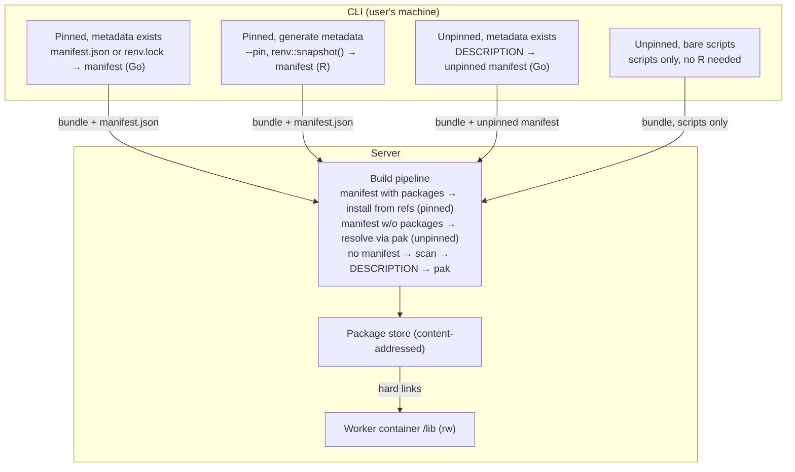
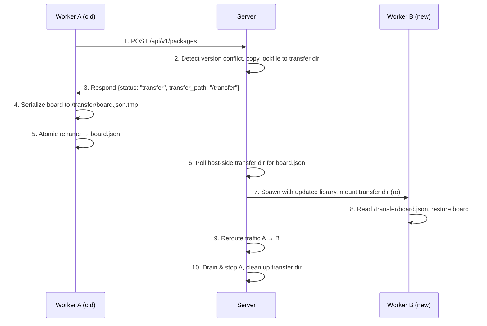

# Dependency Management

Unified design for how blockyard discovers, resolves, caches, and
serves R package dependencies across the full lifecycle: client-side
CLI, server-side build, runtime assembly, and live package requests.

This document supersedes the dependency-specific sections of
phase 2-5 (build pipeline) and phase 2-6 (package store) and adds
the manifest format, CLI integration, and runtime update mechanics.
The implementation details in those phase docs (Go structs, mount
logic, API endpoints) remain authoritative for their scope — this
document provides the architectural overview that ties them together.

## Prior Art

| Platform | Client tool | Lockfile format | Server-side resolution | Notes |
|---|---|---|---|---|
| Posit Connect | rsconnect R pkg | `manifest.json` (embeds full DESCRIPTION per package) | No — client resolves everything | Uses `renv::dependencies()` + `renv::snapshot()` internally, translates to manifest |
| Posit Connect Cloud | rsconnect / Publisher | `manifest.json` committed to git | No | Same format, git-backed deploys |
| Posit Publisher | VS Code extension (Go backend) | `renv.lock` required, translated to `manifest.json` | No | Can build manifest from lockfile alone (no installed packages needed) |
| Ricochet | Rust CLI | `renv.lock` shipped as-is | Yes — `renv::restore()` in build container | No manifest; lockfile is the wire format. No fallback without lockfile |
| blockyard v1 | N/A (direct upload) | `rv.lock` (TOML) | No — `rv sync` from lockfile | rv-specific format, lockfile required |

**Key observation:** no existing platform supports server-side
dependency *discovery* (upload code without any dependency metadata
and let the server figure it out). blockyard's scan mode is novel.

---

## Architecture Overview



Two dependency modes, four input cases:

|  | Metadata exists | CLI generates |
|---|---|---|
| **Pinned** | `manifest.json` (with `packages`) or `renv.lock` present. No R needed (Go converts lockfile → manifest). | `--pin`: R + renv required. `renv::snapshot()` → lockfile → manifest. |
| **Unpinned** | `DESCRIPTION` present. CLI builds unpinned manifest (Go, no R needed). | Bare scripts only. No R needed — server scans via `pkgdepends::scan_deps()`. |

- **Pinned** — every package has an exact version, source, and
  hash. Server installs exactly what the manifest specifies.
  Fully reproducible.
- **Unpinned** — package names with optional version constraints,
  carried in an unpinned manifest. Server resolves to latest
  compatible versions via pak. If `repositories` carries dated PPM
  URLs, CRAN packages resolve against that snapshot; otherwise they
  resolve against the latest repo state. Remotes (GitHub, GitLab,
  etc.) always resolve against their current upstream state
  regardless of repository snapshots.

R is only required on the client for pinning without a lockfile
(`--pin`), where `renv::snapshot()` needs the local library to
resolve exact versions. All other paths are pure Go or need no
client-side processing at all.

---

## Manifest Format

The blockyard manifest combines ideas from renv and Connect,
designed for neither — the server installs via pak, not
`renv::restore()` or `install.packages()`.

The manifest has two shapes, sharing a common envelope (`version`,
`platform`, `metadata`, `repositories`, `files`) but differing in
how they specify dependencies. The `platform` field records the
client's R version (e.g., `"4.4.2"`) — currently informational
(auditing, debugging), but intended to drive build image selection
when multi-version support is added.

- **Pinned manifest** — carries a `packages` map with renv-style
  package records (exact versions, hashes, sources). The server
  installs exactly what the manifest specifies.
- **Unpinned manifest** — carries a `description` object (JSON-ified
  DESCRIPTION fields: `Imports`, `Depends`, `Remotes`, etc.). The
  server resolves dependencies via pak.

Both shapes carry a `repositories` array with platform-neutral
repository URLs. For PPM-backed repos, snapshot dates are encoded
in the URL (e.g., `https://p3m.dev/cran/2026-03-18`). The server
adds its own platform segment when constructing download URLs.

The server dispatches on the presence of `packages`: if it exists,
pinned path; if absent, unpinned path. A manifest carrying both
`packages` and `description` is invalid — the server rejects it.

From **renv** we take the package record format (pinned shape):
field names and platform-neutral repository URLs (renv strips PPM
platform segments at snapshot time). When an `renv.lock` exists,
the Go conversion extracts the fields consumed by the build pipeline
— `Package`, `Version`, `Source`, `Repository`, and `Remote*` —
and drops everything else.

**renv.lock format versions.** renv 1.1+ defaults to a v2 lockfile
format that embeds the full DESCRIPTION per package (Title, Authors@R,
Depends, Imports, Suggests, etc.). The v1 format
(`options(renv.lockfile.version = 1)`) produces minimal records with
`Hash` and `Requirements` instead. The manifest needs neither —
`record_to_ref()` uses only `Source` and `Remote*` fields, which are
present in both formats. When the CLI invokes renv for pinning
(case 1c), it forces v1 for compactness. When a user provides an
renv.lock (case 1b), either format works.

From **Connect** we take the idea of a deployment manifest: a
single artifact that carries app metadata (mode, entrypoint),
file checksums, and a packages map — everything the server needs
to build and run the app.

The pinned manifest does **not** carry pkgdepends ref strings. The
server derives refs from the renv-style package records at install
time — a simple conversion (~20 lines of R) that dispatches on
`Source`/`RemoteType` and concatenates strings. Keeping one
representation (renv records) avoids dual specs that can diverge.

### Pinned Schema

```json
{
  "version": 1,
  "platform": "4.4.2",
  "metadata": {
    "appmode": "shiny",
    "entrypoint": "app.R"
  },
  "repositories": [
    { "Name": "CRAN", "URL": "https://p3m.dev/cran/2026-03-18" }
  ],
  "packages": {
    "shiny": {
      "Package": "shiny",
      "Version": "1.9.1",
      "Source": "Repository",
      "Repository": "CRAN"
    },
    "myghpkg": {
      "Package": "myghpkg",
      "Version": "0.3.1",
      "Source": "GitHub",
      "RemoteType": "github",
      "RemoteHost": "api.github.com",
      "RemoteUsername": "owner",
      "RemoteRepo": "myghpkg",
      "RemoteRef": "main",
      "RemoteSha": "a1b2c3d4e5f6789..."
    },
    "GenomicRanges": {
      "Package": "GenomicRanges",
      "Version": "1.56.0",
      "Source": "Bioconductor"
    }
  },
  "files": {
    "app.R": { "checksum": "abc123..." }
  }
}
```

### Unpinned Schema

```json
{
  "version": 1,
  "platform": "4.4.2",
  "metadata": {
    "appmode": "shiny",
    "entrypoint": "app.R"
  },
  "repositories": [
    { "Name": "CRAN", "URL": "https://p3m.dev/cran/2026-03-18" }
  ],
  "description": {
    "Imports": "shiny (>= 1.8.0), ggplot2, DT",
    "Depends": "R (>= 4.1.0)",
    "Remotes": "blockr-org/blockr"
  },
  "files": {
    "app.R": { "checksum": "abc123..." }
  }
}
```

The `description` object carries DESCRIPTION fields as JSON
strings — each key is a DCF field name, each value is the
unparsed field content. The CLI produces this by splitting the
DESCRIPTION file on its top-level fields. Conversion in either
direction (DESCRIPTION ↔ JSON) is trivial.

The `files` checksums are SHA-256 hex strings.

The `repositories` array works identically in both shapes:
platform-neutral URLs, snapshot dates encoded in PPM URLs where
applicable. When `repositories` is absent or empty, the server
uses its default repository configuration (latest repo state).
`Remotes` entries (GitHub, GitLab, etc.) are never affected by
repository snapshots — they always resolve against their current
upstream.

### Relationship to renv and Connect

**Package records use renv.lock field names.** Each package
entry uses the same field names and casing as an renv.lock record:
`Package`, `Version`, `Source`, `Repository`, and `Remote*` fields
(`RemoteType`, `RemoteUsername`, `RemoteRepo`, `RemoteRef`,
`RemoteSha`, etc.). When an `renv.lock` exists, these fields are
copied unchanged — no renaming, no semantic translation. Fields
not consumed by the build pipeline (`Hash`, `Requirements`, and
DESCRIPTION metadata like `Title`, `Authors@R`, etc.) are not
carried — they differ between renv.lock v1 and v2 formats and
nothing in the pipeline reads them.

Key differences from renv.lock:
- **Top-level metadata** (added) — `version`, `platform`,
  `metadata` (appmode, entrypoint), and `files` (checksums). These
  are deployment concerns that renv.lock doesn't cover.
- **Curated subset of fields** — the manifest carries only the fields
  needed for ref derivation: `Package`, `Version`, `Source`,
  `Repository`, and `Remote*`. Fields like `Hash`, `Requirements`
  (v1), and full DESCRIPTION metadata (v2) are not consumed by the
  build pipeline and are not carried. The server reads `Depends`,
  `Imports`, `LinkingTo`, and `NeedsCompilation` from installed
  packages when needed (at ingest time).

**Repository URLs are platform-neutral.** The `repositories` array
carries base PPM URLs without platform segments (e.g.,
`https://p3m.dev/cran/2026-03-18`, not
`https://p3m.dev/cran/__linux__/noble/2026-03-18`). This follows
renv's own convention — `renv::snapshot()` strips platform
segments via `renv_ppm_normalize()`, and `renv::restore()`
reconstructs them for the target platform via
`renv_ppm_transform()`. Our server does the same: reads the
neutral URL from the manifest and constructs the platform-specific
URL for its own environment (see Ref Derivation and Platform URLs below).

The per-package `Repository` field is a repo **name** (e.g.,
`"CRAN"`), not a URL — matching renv.lock's convention. The name
maps to a URL via the top-level `repositories` array.

**Differences from Connect's `manifest.json`:**
- Connect uses `Github*` field names (`GithubUsername`,
  `GithubRepo`, `GithubSha1`); we use renv's `Remote*` names
  (`RemoteUsername`, `RemoteRepo`, `RemoteSha`) which generalize
  to any remote source (GitHub, GitLab, Bitbucket, etc.).
- Connect embeds a full DESCRIPTION per package (Title, Authors,
  License, BugReports, etc.); we omit this entirely.
- Connect records platform-specific repo URLs per-package; we
  carry platform-neutral URLs in a top-level array.


### Schema Versioning

The `version` field is a positive integer. The server rejects
manifests with a version it does not understand and returns an
error asking the user to update their CLI (or the server). No
backward compatibility across versions — a clean break. Changes
are expected to be rare; the field is an escape hatch, not a
versioning scheme.

### Design Rationale

**Why not ship `renv.lock` directly (like Ricochet)?**
renv.lock lacks deployment metadata (`appmode`, `entrypoint`, file
checksums). More importantly, the server needs to *produce* a
canonical record after DESCRIPTION and scan-mode builds too.
Generating an renv.lock from pak's output would mean
reverse-engineering renv's format from a different tool's data. Our
manifest is our artifact — we define it, we produce it from any
build mode, and we control its evolution.

**Why renv's field names for package records?**
Practical: when `renv.lock` exists, records copy verbatim — no
field renaming, minimal code. And renv's conventions are more
general: `Remote*` fields handle any remote source (GitHub, GitLab,
Bitbucket, git), while Connect's `Github*` fields are
GitHub-specific. renv's platform-neutral URLs (PPM segments stripped
at snapshot, reconstructed at restore) are what we need for a
manifest that travels from client to server across platforms.

**Why Connect's deployment structure?**
Connect proved that a single manifest carrying app metadata,
file checksums, and a packages map is the right shape for
server-side deployment. renv.lock doesn't carry any of this — it's
a project isolation tool, not a deployment artifact.

**Why no `Ref` field?**
pak consumes [pkgdepends ref strings](https://r-lib.github.io/pkgdepends/reference/pkg_refs.html)
(e.g., `shiny@1.9.1`, `owner/repo@sha`). The server derives these
from the renv-style package records at install time — a ~20 line
conversion that dispatches on `Source`/`RemoteType`. Storing both
the renv record and the derived ref would create two
representations of the same information that can diverge. Single
source of truth wins.

---

## CLI Integration (Phase 2-9)

The CLI (`cmd/by/`) prepares the bundle for upload. From the user's
perspective, there are two choices: deploy with pinned dependencies
(reproducible) or unpinned dependencies (convenient). Pinning
requires R + renv on the client (to snapshot exact versions from the
local library). Unpinned deploys need no R on the client at all —
the server handles dependency discovery.

### Deploy Flow

```
by deploy ./myapp/

  Pinned mode (manifest.json in bundle):
  ───────────────────────────────────────
  1a. manifest.json already exists
      → use it (skip to upload). Pure Go, no R needed.

  1b. renv.lock already exists
      → parse JSON, copy package records into manifest,
        add metadata. Pure Go, no R needed.

  1c. No lockfile, user wants pinned deps (--pin flag or prompt)
      → R + renv required
      → renv::dependencies() + renv::snapshot()
      → parse generated renv.lock → build manifest
      → clean up renv artifacts

  Unpinned mode (manifest without packages):
  ────────────────────────────────────────
  2a. DESCRIPTION already exists
      → CLI builds unpinned manifest from DESCRIPTION
        (JSON-ify fields, add metadata + files checksums,
         add repositories from renv/PPM config or
         --repositories flag).
      → Pure Go, no R needed.

  2b. No DESCRIPTION (bare scripts only)
      → upload as-is. No R needed on client.
      → server scans, generates DESCRIPTION, then builds
        unpinned manifest (see Server-Side Build Pipeline).
```

**Priority when multiple files coexist:** `manifest.json` >
`renv.lock` > `DESCRIPTION` > bare scripts. The CLI uses the
highest-priority file and warns if lower-priority files are also
present (e.g., "Using manifest.json; ignoring renv.lock").

The default when neither pinned manifest nor lockfile is present:
if a DESCRIPTION exists, build an unpinned manifest and deploy (2a).
If only scripts exist, upload them and let the server scan (2b).
The CLI never needs R for unpinned deploys — dependency discovery
is always the server's responsibility. R is only required on the
client for pinning (1c), where `renv::snapshot()` needs the local
library to resolve exact versions.

### renv.lock → Manifest Translation

The entire renv.lock → manifest translation is pure Go — no R
subprocess needed. The lockfile is plain JSON. The Go conversion
extracts package identity and source fields; the only transformations
are at the top level.

```
renv.lock                          manifest.json
─────────                          ─────────────
R.Version               →          platform
R.Repositories          →          repositories (URLs already platform-neutral)
Packages.*.Package      →          packages key + packages.*.Package
Packages.*.{identity}   →          packages.*.{identity} (copied unchanged)
```

Package identity and source fields (`Version`, `Source`,
`Repository`, `RemoteType`, `RemoteUsername`, `RemoteRepo`,
`RemoteRef`, `RemoteSha`, `RemoteHost`, `RemoteSubdir`) pass
through unchanged. The CLI adds the top-level `metadata` and `files`
sections. Fields not consumed by the pipeline (`Hash`,
`Requirements`, DESCRIPTION metadata) are dropped — the Go struct
maps only the fields needed for `record_to_ref()`. This works
identically for v1 and v2 lockfiles.

### renv Availability

renv is not part of base R. The CLI only needs R for pinning:

| State | Behavior | Mode |
|---|---|---|
| `manifest.json` with `packages` exists | Use as-is. Pure Go, no R needed. | pinned |
| `renv.lock` exists | Convert to pinned manifest. Pure Go, no R needed. | pinned |
| User requests `--pin`, R + renv available | Scan + snapshot → lockfile → manifest. | pinned |
| User requests `--pin`, no R/renv | Error: "pinning requires R + renv." | — |
| `DESCRIPTION` exists | Build unpinned manifest from DESCRIPTION. Pure Go, no R needed. | unpinned |
| Bare scripts only | Upload as-is. No R needed. Server scans + builds unpinned manifest. | unpinned |

The CLI never requires R for unpinned deploys. Dependency discovery
for bare scripts is always the server's responsibility.

### renv Invocation (Pinning Only)

The CLI only shells out to R for pinning (1c). To avoid modifying
the user's project directory (renv initialization creates
`.Rprofile`, `renv/`, etc.), the CLI runs renv in a temporary
directory:

```r
tmp <- tempfile()
file.copy("/app", tmp, recursive = TRUE)
# Force v1 lockfile format: minimal records with Hash and Requirements.
# v2 (renv 1.1+ default) embeds the full DESCRIPTION per package —
# more data than the manifest needs.
options(renv.consent = TRUE, renv.lockfile.version = 1)
renv::init(project = tmp, bare = TRUE)
deps <- renv::dependencies(tmp, quiet = TRUE, progress = FALSE)
renv::snapshot(tmp, packages = deps$Package,
               library = .libPaths(), prompt = FALSE)
```

The `library = .libPaths()` parameter tells `renv::snapshot()` to
read installed versions from the user's actual library instead of
the empty temp project library. All renv infrastructure (`.Rprofile`,
`renv/`, `renv.lock`) is created inside the temp directory — the
user's project is never touched.

The CLI runs this via `Rscript -e`, reads `{tmp}/renv.lock`,
converts it to a manifest (pure Go), and discards the temp
directory. No cleanup logic needed.

For unpinned deploys (DESCRIPTION or bare scripts), the CLI never
invokes R. Dependency scanning for bare scripts happens server-side
using `pkgdepends::scan_deps()` (see Server-Side Build Pipeline).

---

## Server-Side Build Pipeline

### Build Mode Detection

The server dispatches on the manifest shape. Bare scripts are
normalized to an unpinned manifest before the build begins.

| Priority | Condition | Mode | Strategy |
|---|---|---|---|
| 1 | `manifest.json` with `packages` | Pinned | Install from package records |
| 2 | `manifest.json` with `description` (no `packages`) | Unpinned | Resolve via pak using `description` fields; use `repositories` for repo URLs |
| 3 | No manifest, only scripts | Pre-step | `pkgdepends::scan_deps()` → synthetic DESCRIPTION → build unpinned manifest → unpinned path |

**Bare script pre-processing.** When a bundle arrives without a
manifest, the server scans scripts using
`pkgdepends::scan_deps()`, writes a synthetic DESCRIPTION, and
builds an unpinned manifest from it. Both the synthetic
DESCRIPTION and the generated manifest are persisted alongside
the bundle — from this point on, the case is indistinguishable
from a user-supplied DESCRIPTION (including for refresh):

```r
deps <- pkgdepends::scan_deps("/app")
pkgs <- unique(deps$package[deps$type == "prod"])

dsc <- desc::desc("!new")
dsc$set(Package = "app", Version = "0.0.1")
for (p in pkgs) dsc$set_dep(p, type = "Imports")
dsc$write("/app/DESCRIPTION")
```

This ensures the server can handle bundles uploaded without any
dependency metadata — no R needed on the client for unpinned
deploys.

In all cases, `app.R` (or `server.R`/`ui.R`) must be present —
it is the entrypoint. The DESCRIPTION case is either a plain
directory with `app.R` + `DESCRIPTION` side by side, or a proper
R package with an `.Rbuildignore`'d `app.R` in the root.

**`Suggests` are never installed.** In the unpinned path, the
`deps::` ref tells pak to read `Imports` and `Depends` only —
`Suggests` are excluded by design. In the pinned path, `Suggests`
are absent for a different reason: the CLI passes
`renv::dependencies()` output (which scans for actual usage —
`library()`, `::`, etc.) as the explicit `packages` list to
`renv::snapshot()`, so only packages the app actually uses end up
in the lockfile. The net effect is the same in both modes. If an app
needs a package that is only a transitive `Suggests` dependency
(e.g., `pkg.B` is suggested by `pkg.A`), the user declares `pkg.B`
in their own DESCRIPTION `Imports` or adds a `library(pkg.B)` call
so the scanner picks it up. This keeps dependency trees lean and
avoids pulling in dev/test tooling from upstream packages.

After a successful unpinned build, `by-builder store ingest` emits
a `store-manifest.json` alongside the bundle. This is the driver
for worker assembly, refresh comparison, and rollback. The raw
`pak.lock` is also persisted as a debug/audit artifact (exact
versions, sources, hashes) but the server never re-parses it. The
original unpinned manifest is retained separately for refresh
operations.

### Ref Derivation and Platform URLs

The store-aware build flow (below) uses two conversion helpers:
one to derive pkgdepends ref strings from renv-style package
records (pinned mode only), and one to transform platform-neutral
repository URLs for the server's environment (both modes).

**Record → ref conversion.** The `record_to_ref()` helper converts
an renv-style package record to a
[pkgdepends ref string](https://r-lib.github.io/pkgdepends/reference/pkg_refs.html).
This mirrors renv's internal `renv_record_format_remote(record,
pak = TRUE)` (in `R/records.R`) — a pure function (~20 lines) that
dispatches on `Source`/`RemoteType` and concatenates strings:

```
Source = "Repository"       →  "{package}@{version}"              e.g. shiny@1.9.1
Source = "Bioconductor"     →  "bioc::{package}@{version}"        e.g. bioc::GenomicRanges@1.56.0
Source = "GitHub"           →  "{user}/{repo}@{sha}"              e.g. owner/myghpkg@abc123
Source = "GitLab"           →  "gitlab::{user}/{repo}@{sha}"
Source = "Bitbucket"        →  "bitbucket::{user}/{repo}@{sha}"
Source = "git"              →  "git::{RemoteUrl}"
```

The conversion covers the source types that renv records in its
lockfile. `url::` and `local::` refs are unsupported (see
§ Unsupported ref types below). `SVN` is unsupported — Subversion-
hosted R packages are extremely rare; `StoreKey()` returns a clear
error if encountered. The coupling is to the pkgdepends ref format,
which has been stable for years.

**Platform URL transformation.** The server transforms
platform-neutral PPM URLs to platform-specific ones using the
same logic as renv's `renv_ppm_transform()`: detect the server's
OS and distro (from `/etc/os-release`), insert the
`__linux__/{codename}/` segment into the URL path. This is a
simple string operation — no network calls needed. For non-PPM
repository URLs (e.g., a private CRAN-like repo), no
transformation is applied.

### How pak Works (Relevant Internals)

pak never calls `install.packages()`. It has its own pipeline:

1. **Resolve** — for each ref, query CRAN/Bioc metadata or GitHub
   API. Also scan the target library (`make_installed_cache()`) to
   discover already-installed packages.
2. **Solve** — formulate an Integer Linear Programming problem
   (via lpSolve). The default "lazy" policy assigns cost 0 to
   installed packages, 1 to binary downloads, 5 to source builds.
   Output: an install plan data frame with `lib_status` per package
   (`current` = already installed, `new`, `update`, etc.).
3. **Download** — fetch package archives via pkgcache (a
   content-addressable download cache keyed by URL + ETag).
   Packages with `type == "installed"` are skipped entirely (the
   download handler returns `"Had"`).
4. **Install** — for binary packages: extract archive +
   `file.rename()` into the library. For source packages:
   `R CMD INSTALL --build` via pkgbuild, then extract the
   resulting binary. `install_package_plan()` skips any package
   with `type == "installed"` (sets `install_done = TRUE` at init).

**Lockfile API.** pak exposes `lockfile_create()` and
`lockfile_install()` which split the pipeline at the
resolve/solve boundary:

- `lockfile_create(refs, lockfile, lib)` runs steps 1–2 and writes
  the solved plan to a JSON lockfile. No download, no install.
- `lockfile_install(lockfile, lib, update)` reads the lockfile and
  runs steps 3–4. When `update = TRUE` (the default), it first
  scans the target library via `make_installed_cache()`. Packages
  already present and matching the lockfile entry are marked
  `type = "installed"` and skipped entirely — no download, no
  install.

This split is our integration point with the package store: create
the lockfile, use it to identify store hits, pre-populate the
library with hardlinks from the store, then call
`lockfile_install()` which skips the pre-populated packages.

**Multi-library scanning.** The `library` config accepts a vector
of paths: `config = list(library = c("/target", "/reference"))`.
`make_installed_cache()` scans ALL paths and merges the results.
`install_package_plan()` installs into the FIRST path only. This
lets us tell pak "these packages already exist (reference), install
new ones here (target)" — used for runtime package requests where
the worker already has a populated library.

**When `upgrade` matters.** The solver's upgrade policy (`"lazy"`
= upgrade FALSE, `"upgrade"` = upgrade TRUE) controls whether it
prefers installed packages over newer available versions. This only
affects the outcome when (a) the ref allows multiple versions (not
pinned to an exact version) AND (b) the library already has a
version installed. In our flows, `lockfile_create()` at build time
and refresh time always sees an **empty** library — there is
nothing to "upgrade from," so the policy is irrelevant and the
solver resolves from scratch. Pre-population from the store
happens *after* `lockfile_create()` and only affects
`lockfile_install()`, which does not re-solve. The one place the
policy matters is **runtime package requests**, where
`lockfile_create()` sees the worker's existing library. There we
use the default lazy policy (`upgrade = FALSE`) so the solver
keeps installed versions and only adds what's genuinely new —
minimizing version conflicts with already-loaded packages.

### Store-Aware Build Flow

Every build mode uses the same four-phase pattern: create a pak
lockfile (resolve + solve), check the store using lockfile entries,
install only what's missing, then ingest new packages into the store.
R handles phases 1 and 3 (pak API calls); the `by-builder` Go binary
handles phases 2 and 4 (store operations).

**Container mounts:**

```
/app              (ro)  ← bundle
/pak              (ro)  ← cached pak package
/pak-cache        (rw)  ← persistent pak download cache (shared across builds)
/store            (rw)  ← package store (multi-version, shared across builds)
                          build library created under /store/.builds/{uuid}/
/tools/by-builder (ro)  ← cached Go binary for store operations
```

The persistent download cache (`/pak-cache`) is set via
`Sys.setenv(PKG_CACHE_DIR = "/pak-cache")`. This avoids
re-downloading archives across builds — pak's pkgcache checks
ETags and serves from cache when fresh.

**The flow is identical for pinned and unpinned modes** — the only
difference is how `refs` are derived:

- **Pinned:** `refs` are derived from the manifest's package
  records via `record_to_ref()` (see Ref Derivation and Platform URLs).
  Repository URLs come from the manifest's `repositories` array.
- **Unpinned:** `refs <- "deps::/app"` — pkgdepends reads
  `Imports`, `Depends`, and `Remotes` from the DESCRIPTION file.
  Repository URLs come from the manifest's `repositories` array,
  same as pinned.

```r
library(pak, lib.loc = "/pak")
Sys.setenv(PKG_CACHE_DIR = "/pak-cache")
options(repos = repos)  # from manifest repositories array

# Install target lives on the store volume so that ingestion
# (phase 4) is an atomic rename() — no cross-filesystem copy.
build_lib <- file.path("/store", ".builds", Sys.getenv("BUILD_UUID"))
dir.create(build_lib, recursive = TRUE)

# ── Phase 1: Resolve + solve (R — needs pak) ────────────────────
pak::lockfile_create(refs, lockfile = file.path(build_lib, "pak.lock"),
                     lib = build_lib)

# ── Phase 2: Check store, pre-populate build library (Go binary) ─
# by-builder reads the lockfile, computes source hashes, reads
# configs.json for each package, resolves the matching config hash
# (based on the current lockfile's LinkingTo store keys), and
# hard-links config hits into build_lib.
rc <- system2("/tools/by-builder", c(
  "store", "populate",
  "--lockfile", file.path(build_lib, "pak.lock"),
  "--lib", build_lib, "--store", "/store"))
if (rc != 0L) {
  # Populate failure is non-fatal — pak will install everything from
  # scratch in phase 3. Log the error for diagnostics.
  message("WARNING: store populate failed (exit ", rc,
          "); falling back to full install")
}

# ── Phase 3: Install store misses (R — needs pak) ───────────────
# lockfile_install() scans build_lib (update=TRUE by default),
# finds pre-populated packages, marks them as installed (type =
# "installed"), and skips them — no download, no install. Only
# store misses are downloaded and installed.
pak::lockfile_install(file.path(build_lib, "pak.lock"), lib = build_lib)

# ── Phase 4: Ingest new packages into store (Go binary) ─────────
# by-builder reads each installed DESCRIPTION for NeedsCompilation
# and LinkingTo, computes config hashes, creates config directories,
# updates configs.json, and writes config sidecar files. It also
# writes store-manifest.json to the build library directory — a JSON
# map of {package: "sourceHash/configHash"}.
rc <- system2("/tools/by-builder", c(
  "store", "ingest",
  "--lockfile", file.path(build_lib, "pak.lock"),
  "--lib", build_lib, "--store", "/store"))
if (rc != 0L) {
  stop("store ingest failed (exit ", rc,
       "); store-manifest.json was not written")
}
```

For full store hits, phase 3 is a no-op — the build completes in
seconds. The lockfile drives the store lookup (phase 2) and the
installation (phase 3). The store-manifest (output of phase 4)
drives all downstream operations: worker assembly, refresh
comparison, and rollback.

**Repository-based resolution.** The server reads repository URLs
from the manifest's `repositories` array for both pinned and
unpinned builds. When the URLs include PPM snapshot dates (e.g.,
`https://p3m.dev/cran/2026-03-18`), CRAN packages resolve against
that snapshot. `Remotes` entries (GitHub, GitLab, etc.) resolve
against their current upstream — they are not affected by
repository snapshots. When `repositories` is absent, the server
resolves against its default repository configuration.

**Post-build outputs.** After a successful build, the server stores
two artifacts alongside the bundle: (1) `store-manifest.json` (the
`{package: "sourceHash/configHash"}` map emitted by `by-builder
store ingest`), which drives worker assembly, refresh comparison,
and rollback; (2) `pak.lock` (the raw pak lockfile), retained as a
debug/audit artifact. At worker startup, the store-manifest drives
library assembly: each entry maps directly to a store path, no hash
computation or config resolution needed.

---

## Package Store and Cache Key Design

### The ABI Problem

R packages with compiled code (`NeedsCompilation: yes`) that use
`LinkingTo` compile against header files from the linked package.
The resulting `.so` contains hardcoded assumptions about struct
layouts, function signatures, and ABI conventions from the linked
package's headers *at build time*.

If the linked package later changes those (e.g., Rcpp changes a
struct layout), the dependent package can crash, produce wrong
results, or fail to load. This is not theoretical — the
`Rcpp_precious_remove` incident (2021) broke sf, lme4, and
hundreds of other packages.

**How the ecosystem handles this:**

- **CRAN:** does NOT automatically rebuild reverse-LinkingTo
  dependencies. Manual/ad-hoc only.
- **PPM/P3M:** rebuilds the entire reverse-LinkingTo chain before
  publishing a snapshot. All binaries within a dated snapshot are
  guaranteed mutually compatible.
- **renv:** cache key is an MD5 of the DESCRIPTION file. Same
  package version compiled against different LinkingTo versions
  gets the **same cache key**. This is a
  [known open issue](https://github.com/rstudio/renv/issues/884).
- **R itself:** no mechanism to detect or trigger rebuilds. No
  build-time metadata recorded.

### Our Approach: Lockfile-Keyed Store + Snapshot Coherence

The store key is a curated hash of identity fields from the pak
lockfile entry. This means the key is computable *before*
installation — the lockfile provides everything needed for a store
lookup without reading any installed DESCRIPTION files.

**Store key format:**

```
{platform}/{package}/{curated_hash}/
```

The `platform` prefix encodes the three dimensions that determine
binary compatibility: R version (minor), OS, and architecture. It is
derived from per-package fields in the pak lockfile: `rversion` (short
form, e.g., `"4.5"`) and `platform` (R platform triple, e.g.,
`"x86_64-pc-linux-gnu"`). Format: `{rversion}-{R_platform_triple}`,
e.g., `4.5-x86_64-pc-linux-gnu`. This ensures packages compiled under
different R versions, operating systems, or architectures are never
mixed — even when the system runs a single R version today. When
user-supplied build images or multi-arch support are added, the
store handles it correctly without migration.

**Curated hash computation.** The hash dispatches on
`metadata.RemoteType` from the pak lockfile so that each package
source includes only the fields that determine *what source code was
compiled* — no redundant or absent fields. The hash is implemented
once in Go (`internal/pkgstore/key.go`) and used by both the server
(worker library assembly) and the `by-builder` binary (store operations
inside build containers). No R implementation exists.

**Important:** for `standard` packages, `metadata.RemoteSha` is the
*version string* (e.g., `"1.9.1"`), NOT a content hash. The actual
archive hash is in the top-level `sha256` field. The store key for
standard packages uses `sha256`, not `metadata.RemoteSha`. For
`github`/`gitlab`/`git` packages, `metadata.RemoteSha` is the git
commit SHA — the correct content identifier.

```
hash input = {RemoteType}\0{field1}\0{field2}[...\0{fieldN}]
hash algo  = SHA-256
```

`RemoteType` is always the first element in the hash input to
prevent cross-type collisions (e.g., a CRAN package and a GitHub
package with the same name). Fields are joined with a `\x00`
delimiter to prevent concatenation collisions.

| RemoteType | Identity fields (pak lockfile path) | Rationale |
|---|---|---|
| `standard` | `package`, `version`, `sha256` (all top-level) | `sha256` (archive hash) is the strongest identifier — catches PPM rebuilds where the version is unchanged but the binary differs. |
| `github`, `gitlab`, `bitbucket`, `git` | `package` (top-level), `metadata.RemoteSha`, `metadata.RemoteSubdir` | The commit hash fully identifies the source code. `version` is redundant (it's whatever DESCRIPTION contains at that commit). `RemoteSubdir` selects which package within a monorepo. |

What this produces per package type:

| Type | Key identity (hashed) |
|---|---|
| CRAN binary | `standard\|shiny\|1.9.1\|a1b2c3...` |
| Bioc | `standard\|GenomicRanges\|1.56.0\|b7c8d9...` |
| GitHub | `github\|blockr\|a1b2c3d4e5...\|` |
| GitHub subdir | `github\|mypkg\|f9e8d7...\|src/mypkg` |
| GitLab | `gitlab\|other\|c3d4e5...\|` |
| Bitbucket | `bitbucket\|pkg\|d5e6f7...\|` |
| git | `git\|mypkg\|e4f5a6...\|` |

**Unsupported ref types.** `url::`, `local::`, and `svn::` refs are not
supported. `url::` packages lack a content hash in the pak
lockfile (pak records an HTTP ETag rather than a `sha256` for
url-type downloads, which is too weak for store identity).
`local::` packages would require content-hashing the source tree,
which is outside our current scope. `svn::` (Subversion-hosted
packages) is extremely rare in the R ecosystem. All three produce
a clear error from `StoreKey()` if encountered. Support can be
added later if demand appears.

Examples:
```
4.5-x86_64-pc-linux-gnu/shiny/e3b0c44298fc.../
4.5-x86_64-pc-linux-gnu/Rcpp/a7ffc6f8bf1e.../
4.5-x86_64-pc-linux-gnu/blockr/2c26b46b68ff.../
```

**ABI safety relies on two mechanisms:**

1. **PPM snapshot coherence (primary).** Within a single PPM dated
   snapshot, all binaries are built against each other — the library
   is coherent. Builds that install from a single snapshot produce a
   coherent store population. This covers the vast majority of cases.

2. **Multi-config store entries for the LinkingTo edge case.** The
   store key (curated hash) identifies the *source state* of a
   package but does NOT include `LinkingTo` dependencies — the pak
   lockfile does not contain `LinkingTo` data at the point where the
   key is needed (after `lockfile_create` but before
   `lockfile_install`). Instead, each source hash directory in the
   store can hold *multiple compiled artifacts* for different
   LinkingTo dependency configurations.

   A `configs.json` file at the source-hash level records
   source-level properties (`source_compiled`, `linkingto` package
   names — invariant across configs) and maps each *config hash* to
   the specific set of LinkingTo store keys the package was compiled
   against. Each config hash has its own installed package tree
   directory and a sibling metadata sidecar file.

   The **config hash** is SHA-256 of the sorted
   `{linked_package}\0{store_key}` pairs. For packages without
   `LinkingTo` deps (the majority), the config hash is a canonical
   empty hash (SHA-256 of `""`). The store layout is uniform — no
   structural difference between packages with and without
   `LinkingTo` deps.

   - **At populate:** `by-builder` reads `configs.json`, gets the
     `linkingto` package names, looks up their store keys in the
     current lockfile, computes the expected config hash, and checks
     whether that config exists. A matching config is a hit (hard-
     link from `{source_hash}/{config_hash}/`); no match is a miss.
   - **At ingest:** `by-builder` reads the installed DESCRIPTION to
     get `NeedsCompilation` and `LinkingTo`, computes the config hash
     from the lockfile's store keys for the linked packages, writes
     the installed package tree into a new config directory, updates
     `configs.json` (under lock), and writes the config sidecar.
   - Old configs remain in place (append-only store) — they may be
     in use by running workers and will serve future builds that
     happen to need the same LinkingTo combination.

   In practice the multi-config case rarely fires: PPM binaries are
   pre-built (not source-compiled), and even source-compiled packages
   only produce additional configs when a `LinkingTo` dependency
   changes between two builds. The main scenario is GitHub
   dev-installs where the linked package (e.g., Rcpp) is updated
   independently. Most packages have zero or one config entry.

### Store Layout

The store holds multiple versions of the same package, keyed by
curated hash (source state). Each source hash directory can hold
multiple *config* subdirectories — one per distinct set of
`LinkingTo` dependency versions the package was compiled against.
`/store` is a logical mount point throughout this document — the
host path is a deployment concern.

```
/store/
└── 4.5-x86_64-pc-linux-gnu/
    ├── shiny/
    │   └── e3b0c442.../                ← source hash (v1.9.1 from CRAN)
    │       ├── configs.json            ← source-level metadata + config map
    │       ├── a1b2c3d4.../            ← config: installed package tree
    │       └── a1b2c3d4....json        ← config sidecar (created_at)
    ├── sf/
    │   └── 7d865e95.../                ← source hash (v1.0.0)
    │       ├── configs.json
    │       ├── b5bb9d80.../            ← config A: compiled against Rcpp@key1
    │       ├── b5bb9d80....json
    │       ├── c6cc0a91.../            ← config B: compiled against Rcpp@key2
    │       └── c6cc0a91....json
    ├── ggplot2/
    │   └── b5bb9d80.../
    │       ├── configs.json
    │       ├── e3b0c442.../            ← canonical empty config (no LinkingTo)
    │       └── e3b0c442....json
    └── ...
```

Each `{config_hash}/` directory contains the installed package
tree directly (`DESCRIPTION`, `R/`, `Meta/`, etc. — no nested
package name directory).

**`configs.json`** — stored at the source-hash level. Records
source-level properties (invariant across configs) and maps each
config hash to the LinkingTo store keys it was compiled against.

```json
{
  "source_compiled": true,
  "linkingto": ["Rcpp", "s2"],
  "configs": {
    "b5bb9d80...": {"Rcpp": "a7ffc6f8bf1e...", "s2": "b8e9d7c3f2a1..."},
    "c6cc0a91...": {"Rcpp": "c3d4e5f6a7b8...", "s2": "b8e9d7c3f2a1..."}
  }
}
```

For packages without `LinkingTo` deps (the majority):

```json
{
  "source_compiled": false,
  "linkingto": [],
  "configs": {
    "e3b0c442...": {}
  }
}
```

| Field | Description |
|---|---|
| `source_compiled` | `true` if the package was compiled from source (`NeedsCompilation: yes` in DESCRIPTION). Invariant across configs for the same source. |
| `linkingto` | Sorted list of `LinkingTo` package names from the source DESCRIPTION. Empty for packages without `LinkingTo` deps. Invariant across configs. |
| `configs` | Map of `{config_hash: {linked_pkg: store_key, ...}}`. Each entry represents a distinct compilation against specific versions of the linked packages. |

**Config sidecar file (`{config_hash}.json`)** — stored alongside
the config directory at the source-hash level. Contains only
per-build metadata:

```json
{
  "created_at": "2026-03-18T14:30:00Z"
}
```

**Last-accessed tracking** uses the config sidecar file's
filesystem `mtime` rather than a JSON field — the server `touch`es
the sidecar on every store hit. This avoids rewriting JSON on
every access; `touch` is a metadata-only syscall (`utimes()`).
Eviction queries can scan `mtime` values efficiently without
parsing file contents. Eviction operates at the config level —
individual configs can be evicted independently when they go stale.

An R library is flat — `lib/shiny/` can hold exactly one version.
The bridge between the multi-version store and R's single-version
library is a **view**: a flat directory assembled per-build (or
per-worker) by hard-linking the correct config of each package
from the store.

```
/lib/                            (assembled view)
├── shiny/    → hardlink from /store/.../shiny/{src_hash}/{cfg_hash}/
├── ggplot2/  → hardlink from /store/.../ggplot2/{src_hash}/{cfg_hash}/
└── blockr/   → hardlink from /store/.../blockr/{src_hash}/{cfg_hash}/
```

At build time, version selection is driven by the pak lockfile:
each lockfile entry maps to a source hash via the curated hash, and
the config hash is determined by looking up `configs.json` and
matching the current lockfile's store keys for the package's
`LinkingTo` dependencies. At worker startup, the store-manifest
(a pre-computed `{package: "sourceHash/configHash"}` map) drives
assembly directly — no lockfile re-parsing, no hash computation or
config resolution needed. At runtime (adding packages to `/lib`
after a runtime request produces a new lockfile), the same
build-time resolution applies.

Hard links (not symlinks) are used so the store does not need to
be mounted into worker containers at runtime. The view is
self-contained. **Constraint:** hard links require the store and
the target directory to be on the same filesystem. Build libraries
and runtime staging directories live under `/store/` by design,
satisfying this automatically. Worker `/lib` directories must
also share the store's filesystem (e.g., same Docker volume).

### Store Population

Packages are ingested into the store after `lockfile_install()`
completes (phase 4 of the build flow). The lockfile provides the
source hash — no post-installation hash computation is needed.
The config hash is determined at ingest time from the installed
DESCRIPTION's `LinkingTo` field and the lockfile's store keys.

For each lockfile entry that was not a store hit:

1. Compute the source hash from the lockfile entry (curated hash).
2. Read the installed DESCRIPTION to get `NeedsCompilation` and
   `LinkingTo`. Compute the config hash from the lockfile's store
   keys for the linked packages (empty map → canonical empty hash).
3. Acquire the lock
   (`/store/.locks/{platform}/{package}/{source_hash}.lock`).
4. If the config does not already exist:
   a. Move the installed package tree into
      `{platform}/{package}/{source_hash}/{config_hash}/`.
   b. Write or update `configs.json` — set `source_compiled` and
      `linkingto` (package names), add the config entry with its
      LinkingTo store key map.
   c. Write the config sidecar (`{config_hash}.json`) with
      `created_at`.
5. Release the lock.

**On build failure:** packages that were successfully installed
before the failure remain in the store — they are independently
valid and useful for future builds. The lockfile for the failed
package is cleaned up. The build errors out and the operator
retries (e.g., network issue) or fixes the root cause (e.g.,
missing system dependency). No rollback of successfully ingested
packages.

The store is append-only during normal operation — packages are
never modified after insertion. A background sweeper evicts config
entries whose sidecar `mtime` exceeds a configurable retention
window (opt-in via `store_retention`, e.g., `"720h"`; disabled when
unset). The `mtime` is updated via `touch` on
every store hit, providing last-accessed tracking without additional
bookkeeping. See phase 2-6 step 10 for implementation.

### Store Concurrency

The store is shared across all builds running on the same server.
When concurrent builds need the same package, the first build to
start installing it takes a lock; subsequent builds wait for the
lock to release and then use the store entry.

**Lock protocol:**

1. Before ingesting a package, the build process creates a lock
   directory at `/store/.locks/{platform}/{package}/{hash}.lock`
   via `mkdir`. Directory creation is atomic on all POSIX
   filesystems — exactly one concurrent caller succeeds.
2. If `mkdir` fails (directory already exists), the build knows
   another process is installing the same package. It waits
   (polling with backoff, jittered 0.5–2s) until the lock
   directory is removed and the store entry appears.
3. After successful ingestion (package tree + metadata file
   written), the build removes the lock directory.
4. **Stale lock detection:** if the lock directory's mtime is older
   than a threshold (e.g., 30 minutes), the waiting process removes
   it and re-attempts acquisition. This handles crashed builds that
   never released their lock. PID-based detection is not used
   because builds run in containers with isolated PID namespaces —
   a PID from one container is meaningless to another.

**Write safety:** the lock serializes all writes to a given store
path. Under the lock, the build writes the package tree and the
metadata file as separate operations — no atomicity constraint
between them. A concurrent reader that sees the `{hash}/`
directory can trust that it is complete because the lock is only
released after both writes finish.

---

## Runtime Package Assembly

### Worker Startup

When a worker container starts, the server assembles a single
per-container library at `/lib` by hardlinking packages from the
store based on the bundle's `store-manifest.json` — each entry
maps directly to a store path (`sourceHash/configHash`), with no
hash computation or config resolution needed. R runs with
`.libPaths("/lib")` — one library, one search path.

A single library is simpler than a dual read-only/read-write split:
no `.libPaths()` shadowing semantics, no question about which library
a package lives in, and runtime additions (see below) go into the same
directory. The store is the source of truth for immutability — the
per-container library is a disposable view that can be reconstructed
from any manifest.

The `/lib` mount is **read-only from inside the container**. Runtime
package additions are hardlinked from the host side by the server —
host-side writes are visible through the bind mount regardless of
the ro flag. Making it ro prevents `install.packages()` from inside
R, which is correct since installations must go through the server's
packages API.

### Live Package Requests

A running worker can request additional packages via a **blocking**
API call to the server (`POST /api/v1/packages`). The request body
includes the package name(s) and the R session's currently loaded
namespaces (`loadedNamespaces()`). The call blocks until the
package is available or an error occurs — the R session waits on
the HTTP response before proceeding.

The server uses the same lockfile-based flow as the build, with
one addition: the worker's existing `/lib` is passed as a
reference library so the resolver sees what's already installed.

```r
# Staging directory on the store's filesystem — NOT /tmp, which
# may be a tmpfs. Needed so that (a) store hits can be hardlinked
# in for pak to see, and (b) newly installed packages can be
# atomically renamed into the store after install.
staging <- file.path("/store", ".staging", uuid::UUIDgenerate())
dir.create(staging, recursive = TRUE)

# ── Phase 1: Resolve against existing library (R — needs pak) ────
# Multi-library: staging is the install target (first element),
# worker lib is the reference (second element). pak scans both to
# see what's installed, applies upgrade = FALSE.
pak::lockfile_create(
  "xyz",
  lockfile = file.path(staging, "pak.lock"),
  lib = c(staging, "/containers/{id}/lib")
)
# Lockfile contains the full solution (existing + new).

# ── Phase 2: Pre-populate staging from store + worker library ────
# In runtime mode (--runtime), by-builder:
#   1. Hardlinks unchanged packages from worker lib into staging.
#   2. For packages whose LinkingTo deps changed: looks up a new
#      config in the store (fast path) or excludes from staging
#      (slow path — pak recompiles in phase 3).
#   3. Hardlinks store hits for new/changed packages into staging.
# After this step, staging is a complete library minus packages
# that need ABI recompilation.
rc <- system2("/tools/by-builder", c(
  "store", "populate",
  "--lockfile", file.path(staging, "pak.lock"),
  "--lib", staging, "--store", "/store",
  "--reference-lib", "/containers/{id}/lib",
  "--runtime"))
if (rc != 0L) {
  message("WARNING: store populate failed (exit ", rc,
          "); falling back to full install")
}

# ── Phase 3: Install store misses (R — needs pak) ───────────────
# staging only — NOT c(staging, "/containers/{id}/lib"). Phase 2
# already hardlinked all unchanged packages from the worker library
# into staging. Packages excluded by the ABI check (LinkingTo deps
# changed, no matching store config) are missing from staging, so
# pak reinstalls them — compiling against the new headers already
# present in staging.
pak::lockfile_install(
  file.path(staging, "pak.lock"),
  lib = staging
)

# ── Phase 4: Ingest into store (Go binary) ───────────────────────
# by-builder ingests new packages from staging into the store and
# writes a complete store-manifest.json (including unchanged packages
# carried from the reference library's .packages.json).
rc <- system2("/tools/by-builder", c(
  "store", "ingest",
  "--lockfile", file.path(staging, "pak.lock"),
  "--lib", staging, "--store", "/store",
  "--reference-lib", "/containers/{id}/lib"))
if (rc != 0L) {
  stop("store ingest failed (exit ", rc,
       "); store-manifest.json was not written")
}
```

The staging directory lives on the store's filesystem. This is
critical for two reasons: store hits can be hardlinked into the
staging dir for pak to see as installed (phase 2), and newly
installed packages can be atomically `rename()`'d into the store
(phase 4) — no copy, just a metadata operation. The worker's
`/lib` is never written to by pak — new packages are moved into
the store and then hardlinked from the store into `/lib`.

Three outcomes from the API call:

**1. Available (store hit):** package is already in the store.
Hardlink into `/lib`, return success. Effectively instant.

**2. Available (store miss):** package is not in the store. The
server installs it into the staging directory, copies it into the
store, then hardlinks from the store into `/lib` and returns
success. The API call blocks for the duration of the install —
the R session waits.

**3. Transfer required (version conflict):** after resolving, the
server compares the new store-manifest (output of `by-builder store
ingest` in the staging directory) against the worker's per-container
package manifest (`.packages.json` — a `{package →
"sourceHash/configHash"}` map initialized from the bundle's
store-manifest.json at library assembly and
updated on each live install). For each loaded namespace reported
in the request, the server compares the current compound ref
against the new store-manifest's compound ref for that package. If
any loaded package has a different compound ref, R cannot unload and
reload it — that's a version conflict. The compound ref encodes
both source identity (version/sha256) and ABI configuration
(LinkingTo store keys), so the comparison catches version bumps
AND LinkingTo ABI changes (e.g., sf compiled against a new Rcpp).
The server returns a `"transfer"` response. The R code (blockr)
then serializes the board state to a well-known path and the
server handles the container transfer (see below). Packages that
are installed but not loaded can safely be updated in place (the
hardlink in `/lib` is replaced with the correct version/config,
`.packages.json` is updated).

**Resolution context.** The server resolves runtime package requests
using the same repository configuration as the original build —
the manifest's `repositories` array is preserved and reused. When
repositories include dated PPM URLs, CRAN packages resolve against
the same snapshot that produced the worker's existing library.
When repositories point to latest (no snapshot date), they resolve
against the current repo state. `Remotes` always resolve against
current upstream, matching build-time behavior.

This is why **unpinned + dated PPM repositories is the ideal basis
for runtime requests**. Two mechanisms work together to minimize
transfers:

1. **Same frozen CRAN state.** Both the initial build and any
   runtime additions resolve against the same dated snapshot via the
   same tool (pak). pak's solver, given identical repo metadata,
   produces identical dependency versions — so a newly requested
   package's transitive dependencies will match what's already
   installed.

2. **Lazy upgrade policy.** The server resolves runtime requests
   with `upgrade = FALSE` against the worker's existing library.
   pak's solver treats already-installed packages as zero-cost (its
   "lazy" policy — see How pak Works above) and only selects a
   different version of a transitive dependency when the new
   package's constraints *strictly require* it. Combined with the
   snapshot (which ensures the available versions haven't shifted
   since the build), this means pak will reuse the installed version
   of every shared dependency unless forced otherwise.

Together, version conflicts (and therefore transfers) can only arise
when a newly requested package carries a hard constraint that is
incompatible with an already-loaded version — a genuine conflict,
not an artifact of resolution drift. `Remotes` that have moved
forward can also trigger conflicts, but those are user-controlled
and expected.

The alternatives are worse along this axis:

- **Without dated repos** (fully floating): the server resolves
  against the current repo state, which shifts continuously. Even
  with `upgrade = FALSE`, pak's solver can only reuse an installed
  version if it is *available* in the repo metadata it sees. When
  CRAN has published a newer version and the repo metadata no
  longer lists the installed version as the default, the solver may
  be forced to pick the newer one — not because a hard constraint
  demands it, but because the resolution inputs have changed. The
  longer a worker runs, the more likely this drift, and the more
  likely a transfer.

- **Pinned**: every build-time package has an exact version, but a
  runtime request for a *new* package (not in the manifest) must
  still be resolved. Even using the manifest's repository snapshot
  URLs, there is no guarantee that pak's resolution will select the
  same versions that renv captured — renv snapshots the user's
  local library state, which may diverge from what pak would
  independently resolve from the same snapshot. For example, if the
  user has an older version of a transitive dependency installed
  locally, renv pins that older version, but pak resolves the new
  package's dependencies at the snapshot's (newer) version. The
  lazy policy cannot help here: the installed version is the one
  renv pinned, but pak's resolution metadata comes from the
  snapshot where that version may not be the natural choice. That
  mismatch is a version conflict, triggering a transfer for a
  reason entirely outside the user's control.

Unpinned + dated repos avoids both failure modes: one tool (pak), one
resolution context (the repository snapshot), applied uniformly to every
package — whether resolved at build time or at runtime. The lazy
policy then ensures that even within that shared context, pak makes
the minimal change necessary. The transfer path still exists for
genuine conflicts (e.g., a new package that strictly requires a
newer version of a loaded dependency), but the *incidental*
conflicts caused by tool mismatch or time drift are eliminated.

### Container Transfer (Version Conflict Case)

The transfer is driven entirely by the API response — no separate
signaling mechanism is needed.



**We do NOT serialize the R session.** blockr has built-in board
serialization (to/from JSON). The API response includes the
container-side path (`/transfer`) — the R session writes where it's
told. The server maps this to the host-side path via the bind mount:

```
Container:  /transfer/board.json         (Worker A writes here)
Host:       {bundle_server_path}/.transfers/{worker_id}/board.json
```

Every worker gets a per-worker transfer directory pre-mounted
read-write at `/transfer` at spawn time. The directory is empty
until a transfer is triggered. Worker B gets the old worker's
transfer directory mounted read-only at the same path. The server
cleans up after the transfer completes.

**Ready signaling:** blockr writes the board state to
`board.json.tmp`, then `rename()`s to `board.json` (atomic on the
same filesystem). The server polls for `board.json` via `stat()`
at ~100ms intervals — a single syscall per check, negligible
overhead for an operation that happens rarely. When the file
appears, the write is guaranteed complete. No sentinel file, no
HTTP callback, no `inotify` dependency. The poll has a timeout
(e.g., 30 seconds) — if the file does not appear, the server
aborts the transfer, cleans up the transfer directory, and treats
the worker as failed.

**Traffic rerouting:** the proxy switches the route from A to B.
This already exists in the autoscaling/worker eviction path.

For apps that are NOT blockr (plain Shiny apps), the version
conflict case is a hard restart — session is lost, user reconnects.
This matches the behavior of a normal redeploy.

---

## Dependency Refresh

Pinned deployments (those with a pinned manifest) have every
dependency locked to an exact version — updating requires a new
deploy. Unpinned deployments (unpinned manifest with `description`
fields) are eligible for refresh. What refresh actually updates
depends on whether the `repositories` array carries dated PPM URLs.

### What Refresh Does

A refresh re-runs the build pipeline for an existing bundle without
re-uploading code:

1. Take the original unpinned manifest (preserved from the initial
   deploy — distinct from the pak lockfile generated post-build).
2. Re-resolve dependencies: for `Remotes`, always resolve against
   current upstream. For CRAN/PPM packages, resolve using the
   manifest's `repositories` URLs (dated PPM → fixed snapshot,
   undated → latest repo state).
3. Run the standard lockfile-based build flow (lockfile → store
   check → pre-populate → install misses → ingest).
4. Store the new store-manifest.json alongside the bundle (along
   with the new pak.lock as a debug/audit artifact).
5. Spawn new worker(s) with the updated library. Mark old workers
   as **draining** — no new sessions routed to them. Existing
   sessions continue undisturbed until they naturally end, then the
   old worker is evicted.

The bundle's code is unchanged — only the dependency versions move
forward. The previous store-manifest is kept for rollback.

**No session disruption.** Unlike live install conflicts (which
require container transfer because a loaded package must change),
refresh uses graceful drain. Running sessions keep their current
libraries. Only new sessions get the updated dependencies. This
means stale workers run for hours at most — not days — as sessions
naturally end and the load balancer stops routing new traffic.

### What Gets Updated

The repository URLs control the boundary between what moves and
what stays fixed:

**Without dated repos** (fully floating):

| Source | What moves forward | What stays pinned |
|---|---|---|
| `Imports: shiny` | Latest shiny from repo | Nothing |
| `Imports: shiny (>= 1.8.0)` | Latest shiny >= 1.8.0 | Lower bound respected |
| `Remotes: owner/repo` | Latest commit on default branch | — |
| `Remotes: owner/repo@v1.0.0` | Stays at tag v1.0.0 | Tag is a pin |
| Scan-generated (`library(shiny)` → `Imports: shiny`) | Latest shiny from repo | Nothing |

**With dated repos** (3rd-party frozen, dev packages float):

| Source | What moves forward | What stays pinned |
|---|---|---|
| `Imports: shiny` | Nothing — resolves against fixed snapshot | Dated repo pins the version |
| `Imports: shiny (>= 1.8.0)` | Nothing — dated repo determines version | Dated repo + lower bound |
| `Remotes: owner/repo` | Latest commit on default branch | — |
| `Remotes: owner/repo@v1.0.0` | Stays at tag v1.0.0 | Tag is a pin |
| Scan-generated (`library(shiny)` → `Imports: shiny`) | Nothing — dated repo pins | Dated repo pins the version |

With dated repos, refresh effectively only moves `Remotes` forward.
CRAN packages are frozen to the dated repo URLs. To update CRAN
packages, redeploy with updated repository URLs.

Transitive dependencies follow the same logic — pak's solver picks
the latest versions that satisfy all constraints within the
configured repository state.

### Triggers

- **Manual:** `by refresh <app-id>` from the CLI, or a button in
  the dashboard. Useful after a known upstream release.
- **Scheduled:** configurable per-app cron (e.g., weekly). The
  server runs refresh, and if any dependency versions changed,
  performs the worker swap. If nothing changed, it's a no-op.

### Scope and Constraints

Refresh is **only available for unpinned deployments** — those
deployed with an unpinned manifest (no `packages`). If a pinned
manifest was uploaded, the user explicitly chose reproducibility;
refreshing would violate that contract. The CLI warns about this
distinction:

```
$ by refresh my-app
Error: my-app was deployed with pinned dependencies.
Redeploy to update.
```

Note: for dated-repo unpinned deploys, refresh is technically
available but will only move `Remotes` forward — CRAN packages
remain locked to the dated repo URLs. This is intentional and is
the primary use case for dated repos: stable 3rd-party deps with
floating dev packages.

Refresh does **not** update the app's code. If the app source
needs changes to work with newer dependency versions, that requires
a new deploy.

### Rollback

Each refresh produces a new store-manifest. Two rollback targets
are available:

- **Previous refresh** (`store-manifest.json.prev`): undo the last
  refresh. The current (bad) manifest is discarded — rolling back
  is a destructive undo, not a swap. There is no "redo."
- **Original build** (`store-manifest.json.build`): return to the
  deploy-time baseline. Written once at initial deploy, never
  overwritten by refresh. Always available regardless of how many
  refreshes have occurred.

The store still holds all package versions (append-only), so both
rollback operations are instant library reassembly via hardlinks —
no rebuilding needed.

---

## Design Decisions

1. **Two dependency modes, not three build paths.** The server has
   two modes: pinned (manifest with `packages`) and unpinned
   (manifest with `description`). Bare scripts are not a separate
   mode — the server normalizes them to an unpinned manifest using
   `pkgdepends::scan_deps()` before entering the unpinned path.
   This eliminates a separate code path and makes the unpinned mode
   uniform regardless of how the DESCRIPTION was produced.

   **Dependency scanning is server-only.** The CLI never scans
   scripts for dependencies. For unpinned deploys, bare scripts are
   uploaded as-is and the server runs `pkgdepends::scan_deps()`
   (a public API in pkgdepends, which ships with pak). This keeps
   the client free of any R dependency for unpinned deploys. R is
   only required on the client for pinning, where
   `renv::snapshot()` needs the local library to resolve exact
   versions.

2. **One manifest file, two shapes.** Both pinned and unpinned
   deploys produce a `manifest.json` with a shared envelope
   (`version`, `platform`, `metadata`, `repositories`, `files`).
   The server dispatches on the presence of `packages`: pinned
   manifests carry renv-style package records; unpinned manifests
   carry `description` (JSON-ified DESCRIPTION fields). This avoids
   a separate wire format for each mode while keeping a single
   artifact the server can inspect to determine what to do.

   The unpinned manifest's `description` fields are literal string
   copies of DCF field values — no parsing, no structured
   representation. This makes round-tripping between DESCRIPTION
   and JSON trivial in either direction.

3. **Pinned manifest combines renv + Connect, designed for pak.**
   The pinned manifest takes package records from renv (field names,
   platform-neutral URLs, hashes) and deployment structure from
   Connect (app metadata, file checksums, packages map). renv's
   conventions win for package records because they're more general
   (`Remote*` handles any source, not just GitHub), already
   platform-neutral, and copy from `renv.lock` verbatim. Connect's
   structure wins for deployment metadata because it's a proven
   model for "everything the server needs in one file." The server
   derives pkgdepends ref strings from the renv records at install
   time (~20 lines of R) rather than storing them in the manifest
   — one representation, no risk of divergence.

   **renv for client-side capture, pak for server-side install.**
   These are two tools with two jobs. renv captures the deployer's
   known-working dependency state: "the intersection of what is
   installed and what is an actual dependency," recorded in a
   platform-agnostic way. The lockfile is a portable bill of
   materials. pak fulfills that bill on the server: resolving
   what needs to be installed (given what the store already has),
   fetching packages efficiently (binary vs source, cache hits),
   and installing with a proper constraint solver. renv is
   optional — users can deploy without it and the server handles
   everything via pak.

4. **Repository URLs carry snapshot dates.** Both manifest shapes
   share a `repositories` array with platform-neutral URLs. When
   the URLs include PPM snapshot dates (e.g.,
   `https://p3m.dev/cran/2026-03-18`), CRAN resolution is pinned
   to that date. `Remotes` are unaffected — they always resolve
   against current upstream. This creates a middle ground between
   fully pinned (exact versions via renv) and fully floating
   (latest everything): 3rd-party packages are stable, dev packages
   move forward. When repositories carry undated URLs (or are
   absent), resolution uses the latest repo state. The URLs are
   platform-neutral — the server injects its own platform segment
   at resolve time.

   **Dated repos also make runtime package requests safe.** Because
   both the build and any runtime additions resolve through the same
   tool (pak) against the same frozen CRAN state, newly requested
   packages get dependency versions identical to what's already
   installed. pak's lazy upgrade policy (`upgrade = FALSE`) adds a
   second layer: it only updates a transitive dependency when the
   new package strictly requires it, reusing installed versions
   wherever possible. Together — frozen inputs, minimal-effort
   solver — version conflicts and therefore container transfers are
   reduced to cases of genuine incompatibility. See "Resolution
   context" in Runtime Package Assembly for the full argument and
   comparison with the pinned and undated-repo alternatives.

5. **pak as the dependency resolver, not renv.** pak has a proper
   constraint solver (ILP via lpSolve), supports two input modes
   (manifest refs, DESCRIPTION), and bundles all
   dependencies into a single self-contained package. renv lacks a
   solver and is primarily a project isolation tool. renv's global
   cache is appealing, but the renv + pak integration is broken —
   when pak is enabled as renv's install backend, the two cache
   systems don't coordinate (open issues #1846, #1334, #1210).
   Rather than depend on a broken integration, we implement our own
   cache layer inspired by renv's design.

6. **Our own cache layer instead of renv's.** renv's cache is
   designed for interactive development (symlinks, project
   isolation, sandbox, .Rprofile shims). We need server-side build
   caching in containers where none of that applies. Our store uses
   hard links (self-contained views, no runtime dependency on the
   store mount), lockfile-keyed hashes (curated from pak lockfile
   entries), and integrates with pak via the lockfile API. The
   store is also shared across all apps on the server, not
   per-project.

7. **Lockfile as the store integration point.** pak's
   `lockfile_create()` resolves and solves without downloading or
   installing — a natural checkpoint to inspect the plan and check
   the store. `lockfile_install()` then scans the target library
   (via `make_installed_cache()`) and skips packages already
   present. The integration is: create lockfile → compute store
   keys from lockfile entries → pre-populate the library with store
   hits → call `lockfile_install()` which skips them. No plan
   modification, no internal API hacking — just the public lockfile
   API plus filesystem pre-population. After ingest, `by-builder`
   emits a `store-manifest.json` that captures the resolved store
   paths for each package. This pre-computed manifest becomes the
   integration point for all downstream operations (worker assembly,
   refresh comparison, rollback), eliminating the need to re-parse
   the lockfile or re-compute store keys outside the build.

8. **Persistent pak download cache across builds.** pak's pkgcache
   stores downloaded archives keyed by URL + ETag. Mounting a
   persistent directory at `PKG_CACHE_DIR` across builds avoids
   re-downloading packages that haven't changed upstream. This is
   orthogonal to the store (which caches *installed* packages) —
   the download cache helps even for store misses.

9. **Two-level store key: source hash + config hash.** The store
   uses a two-level keying scheme. The *source hash* (curated hash
   of lockfile identity fields, dispatched on `RemoteType`) identifies
   the source code: `package + version + sha256` for standard,
   `package + RemoteSha + RemoteSubdir` for github/gitlab/git. The
   *config hash* identifies the ABI context: SHA-256 of the sorted
   `{linked_package}\0{store_key}` pairs from `LinkingTo`
   dependencies. For packages without `LinkingTo` deps, the config
   hash is a canonical empty hash.

   The source hash is fully computable from the lockfile before
   installation. The config hash requires reading `configs.json`
   (written at a prior ingestion) to learn the `LinkingTo` package
   names, then looking up their store keys in the current lockfile.
   At ingest time, the installed DESCRIPTION provides `LinkingTo`.

   This two-level scheme solves the ABI problem without baking
   `LinkingTo` information into the source hash (which would require
   data not available from the lockfile alone). The same source can
   have multiple compiled artifacts for different LinkingTo
   configurations, each independently usable and evictable. See
   § The ABI Problem for the full rationale.

   `url::`, `local::`, and `svn::` refs are unsupported (clear
   error); all are niche and lack reliable content identifiers in
   the lockfile.

10. **Platform-aware store key.** The store key includes a
   `{rversion}-{R_platform_triple}` prefix (e.g.,
   `4.5-x86_64-pc-linux-gnu`).
   R binary packages are incompatible across minor R versions, and
   compiled code is architecture- and OS-specific. Including all
   three dimensions from the start means the store is correct by
   construction when user-supplied build images or multi-arch
   support are added — no migration required.

11. **Private package sources via builder config, not manifest.**
   Credentials for private GitHub repos (`GITHUB_PAT` env var) and
   private CRAN-like repos (`.netrc` file for HTTP authentication)
   are injected into the build container via builder configuration.
   Credentials never appear in the manifest. This follows the same
   pattern as user-suppliable build images — the builder config is
   the extensibility surface for deployment-specific concerns.

12. **System dependencies are a build image concern.** R packages
   with compiled code often require system libraries (`libcurl-dev`,
   `libxml2-dev`, etc.). The default build image includes common
   system libraries. For packages requiring uncommon libraries,
   user-supplied build images are the escape hatch — users provide
   a custom image with the necessary system dependencies
   pre-installed. The manifest does not record system dependencies
   because they are platform-specific and not portable across
   operating systems.

13. **Single per-container library, read-only from inside.**
   Each worker gets a single library at `/lib`, assembled from the
   store via hardlinks at startup and mounted **read-only** into the
   container. The alternative — a read-only `/app-lib` (build output)
   plus a read-write `/extra-lib` (runtime additions) with
   `.libPaths()` shadowing — adds complexity without meaningful
   benefit. The dual-lib approach requires reasoning about search
   order, creates ambiguity about which library a package lives in,
   and makes `find.package()` return paths from different roots
   depending on when a package was added. With a single library,
   runtime additions are hardlinked into the same directory as
   build-time packages — one path, one search. Runtime package
   additions (phase 2-7) are hardlinked from the **host side** by
   the server — host-side writes to the underlying directory are
   visible through the bind mount regardless of the ro flag. The ro
   mount prevents `install.packages()` from inside R, which is
   correct since installations must go through the server's packages
   API. The store is the immutability guarantee. Any container's
   library can be reconstructed from its store-manifest at any time.

14. **Blocking API for runtime package requests.** The runtime
   package API (`POST /api/v1/packages`) blocks until the package
   is available or an error occurs. On a store hit, the server
   hardlinks and returns immediately. On a store miss, the server
   installs the package (using the same pak pipeline as the build),
   ingests it into the store, hardlinks it, then returns. The R
   session waits on the HTTP response — no polling, no callbacks,
   no async complexity. This also solves the container transfer
   signaling problem: when a version conflict requires a new
   container, the API returns `"transfer"` instead of blocking. The
   R code (blockr) serializes the board state via atomic rename;
   the server watches for the file to appear. The API response is
   the signal for the common case; the atomic rename is the signal
   for transfers — no websocket or helper package needed.

15. **Store operations in Go via `by-builder`, not R.** All store
   operations (key computation, store lookups, hard-linking,
   ingestion, locking, ABI checks, metadata) are implemented in Go
   (`internal/pkgstore`) and run inside build containers via a small
   Go CLI binary (`by-builder`). R scripts only call pak APIs
   (`lockfile_create`, `lockfile_install`) and shell out to
   `by-builder` for store phases. This eliminates the cross-language
   parity risk — `StoreKey()` exists only in Go, no R-side
   `digest()` equivalent. The binary is cross-compiled at release
   time for `linux/amd64` and `linux/arm64`, cached on the server
   (same pattern as pak), mounted read-only at `/tools/by-builder`,
   and selected at runtime via `runtime.GOARCH`. It shares
   `internal/pkgstore` with the server — no code duplication.

---

## Open Questions

1. **Manifest signing.** Should the CLI sign the manifest so the
   server can verify it wasn't tampered with in transit? Relevant
   when the upload path is not fully trusted (e.g., CI pipelines
   with shared credentials).

2. **Incremental uploads.** The `files` section with checksums
   enables Connect-style incremental deploys (only upload changed
   files). Worth implementing in v2 or defer?

3. **Multi-language support.** This document covers R only. Python
   and Julia support (if added) would follow similar patterns but
   with different tools (uv/pip for Python, Pkg.jl for Julia).
   The manifest format should be extensible to accommodate this.

4. **Store eviction policy.** Addressed in phase 2-6 step 10. A
   background sweeper evicts config entries whose sidecar mtime
   (last-accessed) exceeds a configurable retention window (opt-in
   via `store_retention`, e.g., `"720h"`; disabled when unset).
   Empty parent directories are cleaned up. This also naturally
   handles cache key evolution: if the curated hash algorithm
   changes, old entries become unreferenced and are eventually
   evicted.
