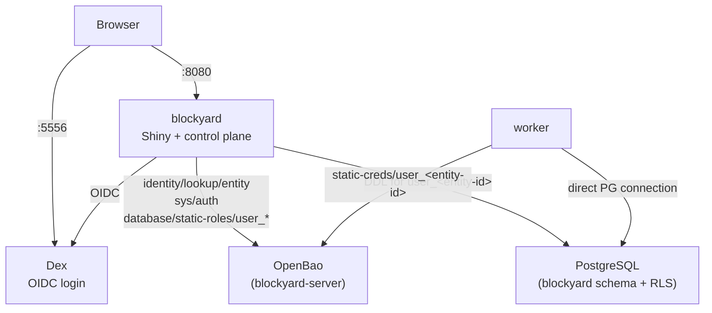

# hello-postgres

Board storage with direct PostgreSQL connections from the Shiny
worker, per-user DB credentials minted and rotated by vault, and
row-level security on the board tables.

Two demo users are pre-provisioned via Dex to demonstrate isolation.

## What's included

- **Dex** — OIDC identity provider with two static test users.
- **PostgreSQL** — board storage backend (`blockyard` schema with
  RLS on `boards`, `board_versions`, `board_shares`).
- **OpenBao** — JWT auth backed by Dex, AppRole auth for blockyard,
  DB secrets engine that owns every user's PG password.
- **Blockyard** — configured for OIDC login, AppRole auth to vault,
  and per-user PG role provisioning (`database.board_storage = true`).

## Prerequisites

- Docker (with Compose v2)

## Usage

```bash
# Start the full stack (Dex, Postgres, OpenBao, blockyard)
docker compose up -d --wait

# Deploy the Shiny app
./deploy.sh

# Open in the browser — you'll be redirected to Dex to log in
open http://localhost:8080/
```

### Test credentials

Both users share the password `password`.

| User   | Email                |
|--------|----------------------|
| User 1 | `demo@example.com`  |
| User 2 | `demo2@example.com` |

## How auth flows at runtime

End-to-end, so the trust boundaries are visible:

1. **OIDC login (Dex → vault).** The user authenticates to Dex and
   blockyard exchanges the ID token for a vault token via the JWT
   auth method. Vault creates the user's entity on first login and
   attaches the `blockyard-user-template` policy to the token — that
   policy is templated on `{{identity.entity.id}}` and grants read on
   one, and only one, `database/static-creds/user_<entity-id>` path.

2. **Per-user PG role (blockyard → vault + Postgres, first login only).**
   Blockyard resolves the vault entity ID via
   `POST /v1/identity/lookup/entity`, derives the role name
   `user_<entity-id>`, creates it in Postgres (with grants to
   `blockr_user` via INHERIT and `vault_db_admin` via ADMIN OPTION),
   and registers it as a vault DB static role. Vault rotates the
   password on first registration; subsequent reads of
   `database/static-creds/user_<entity-id>` return the current one.

3. **Session headers (blockyard → worker).** On every proxied request,
   blockyard injects `X-Blockyard-Vault-Token` and
   `X-Blockyard-Pg-Role`. The worker also has `VAULT_ADDR` and
   `BLOCKYARD_VAULT_DB_MOUNT` in its environment.

4. **Cred fetch (worker → vault).** R assembles the creds URL as
   `{VAULT_ADDR}/v1/{BLOCKYARD_VAULT_DB_MOUNT}/static-creds/{role}` and
   reads it with the user's vault token. Vault's templated policy
   scopes the call to the caller's own row; a mismatched path fails
   at the policy check, not at blockyard.

5. **Direct PG (worker → Postgres).** R opens a plain Postgres
   connection with the returned `{username, password}`. Blockyard is
   not in this connection. RLS on `boards` / `board_versions` /
   `board_shares` enforces row-level scoping.

The access-control chain at runtime is **vault policy → PG role
grants → RLS**. Blockyard code enforces nothing on the data path.
A compromised blockyard token yields role-definition power only
(define `user_*` DB roles, read its own admin creds) — it cannot
mint any user's creds and cannot modify vault policies.

## What `setup.sh` configures

1. JWT auth method, trusted by Dex's JWKS.
2. AppRole auth for blockyard's own token.
3. DB secrets engine mounted at `database/`, with a `blockyard`
   connection registered using `vault_db_admin` as the managing
   identity.
4. `blockyard-server` policy attached to blockyard's AppRole —
   capabilities: create/update/delete/read `database/static-roles/user_*`,
   read `database/static-creds/blockyard_app`, update
   `identity/lookup/entity`, read `sys/auth`, plus the pre-existing
   KV paths blockyard needs.
5. `blockyard-user-template` policy with the per-user templated
   `database/static-creds/user_{{identity.entity.id}}` path. Written
   once at setup, attached via the JWT role's `token_policies` so
   every user token carries it.
6. `blockyard-user` JWT role — the route that resolves a Dex ID
   token into a scoped vault token.

## Architecture



## Services

| Service    | Port | Purpose                                |
|------------|------|----------------------------------------|
| blockyard  | 8080 | Shiny app platform                     |
| dex        | 5556 | OIDC identity provider                 |
| openbao    | 8200 | Secrets management (dev mode)          |
| postgres   | 5432 | Board storage (direct PG)              |
| init       | —    | One-shot: configures vault + DB engine |

## Verifying the policy boundaries

Once the stack is running, three small checks confirm the security
invariant holds:

```bash
# blockyard's token cannot read any user's DB creds.
# Issues an AppRole login to get blockyard's own token:
BLOCKYARD_TOKEN=$(curl -s -X POST \
  -d '{"role_id":"blockyard-server","secret_id":"dev-secret-id-for-local-use-only"}' \
  http://localhost:8200/v1/auth/approle/login | jq -r .auth.client_token)

# Pick any provisioned user role and confirm blockyard can't read it:
curl -sI -H "X-Vault-Token:${BLOCKYARD_TOKEN}" \
  http://localhost:8200/v1/database/static-creds/user_00000000-0000-0000-0000-000000000000
# → 403 Forbidden (policy denies the path)

# blockyard's token also cannot touch vault's identity-write side:
curl -sI -X POST -H "X-Vault-Token:${BLOCKYARD_TOKEN}" \
  -d '{}' http://localhost:8200/v1/identity/entity/id/any-entity
# → 403 Forbidden
```

## Vault ↔ OpenBao parity

This example uses OpenBao, which forked from HashiCorp Vault 1.14.
Every primitive depended on — JWT/OIDC auth, identity entities +
aliases, templated ACL policies, DB secrets engine with static roles —
carries forward. The runbook is vault/openbao-agnostic.

## Cleanup

```bash
docker compose down -v
```

## Notes

- All services run in **dev/ephemeral mode** — data is not persisted
  across restarts. `./data` survives `docker compose down` but not
  `down -v`.
- Per-user passwords are rotated by vault on the `vault_rotation_period`
  cadence (default 24h, configured via
  `database.vault_rotation_period`). R re-reads creds on every
  request, so rotation is transparent.
- The `blockyard-services` Docker network makes Postgres and OpenBao
  reachable from worker containers. Add more services to this network
  to expose them to workers.
- `init.sql` only seeds `vault_db_admin`. Every other PG role is
  created at runtime (blockyard startup SQL, migration 001 for
  `blockr_user`, per-user provisioning for `user_<entity-id>`).
